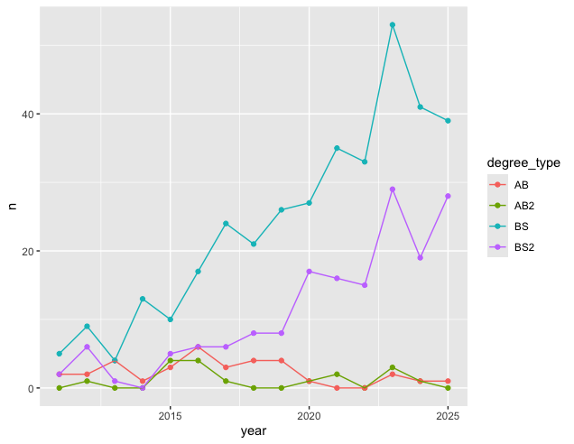

::: callout-important
These are suggested answers.
This document should be used as reference only, it's not designed to be an exhaustive key.
:::

## Goal

Our ultimate goal in this application exercise is to make the following data visualization.

{fig-align="center"}

## Data

The data come from the [Office of the University Registrar](https://registrar.duke.edu/registration/enrollment-statistics). They make the data available as a table that you can download as a PDF, but I've put the data exported in a CSV file for you. Let's load that in.

```{r}
#| label: load-packages-data
#| message: false

library(tidyverse)

statsci <- read_csv("data/statsci_clean.csv")
```

And let's take a look at the data.

```{r}
statsci
```

## Pivoting

-   **Demo:** Pivot the `statsci` data frame *longer* such that:

    -   Each row represents a degree type / year combination
    -   `year` and `n`umber of graduates for that year are columns in the data frame
    -   The resulting `year` column is numeric

```{r}
#| label: pivot

statsci |>
  pivot_longer(
    cols = -degree_type,
    names_to = "year",
    values_to = "n",
    names_transform = as.numeric
  )
```

-   **Your Turn:** Now, repeat your code from above, but this time **save the result** to a **new** variable name.

```{r}
#| label: pivot-with-transform-name

statsci_longer <- statsci |>
  pivot_longer(
    cols = -degree_type,
    names_to = "year",
    names_transform = as.numeric,
    values_to = "n"
  )
```

## Plotting

-   **Your turn:** Now we will start making our plot, but let's not get too fancy right away. Create the following plot, which will serve as the "first draft" on the way to our [Goal]. Do this by adding on to your pipeline from earlier.

{fig-alt="Line plot of numbers of Statistical Science majors over the years (2011 - 2021). Degree types represented are BS, BS2, AB, AB2. There is an increasing trend in BS degrees and somewhat steady trend in AB degrees." fig-align="center"}

```{r}
#| label: plot-draft

statsci_longer |>
  ggplot(aes(x = year, y = n, color = degree_type)) +
  geom_point() +
  geom_line()
```

-   **Question**: Why was the pivot necessary in order to create this plot?

*Add your response here!*

-   **Question:** What aspects of the plot need to be updated to go from the draft you created above to the [Goal] plot at the beginning of this application exercise.

*Add your response here.*

-   **Demo:** Update x-axis scale such that the years displayed go from 2011 to 2025 in increments of 2 years. Do this by adding on to your pipeline from earlier.

```{r}
#| label: plot-improve-1
statsci_longer |>
  ggplot(aes(x = year, y = n, color = degree_type)) +
  geom_point() +
  geom_line() +
  scale_x_continuous(breaks = seq(2011, 2025, 2))
```

-   **Demo:** Update line colors using the following level / color assignments. Once again, do this by adding on to your pipeline from earlier.
    -   "BS" = "cadetblue4"

    -   "BS2" = "cadetblue3"

    -   "AB" = "lightgoldenrod4"

    -   "AB2" = "lightgoldenrod3"

```{r}
#| label: plot-improve-2

statsci_longer |>
  ggplot(aes(x = year, y = n, color = degree_type)) +
  geom_point() +
  geom_line() +
  scale_x_continuous(breaks = seq(2011, 2025, 2)) +
  scale_color_manual(
    values = c(
      "BS" = "cadetblue4",
      "BS2" = "cadetblue3",
      "AB" = "lightgoldenrod4",
      "AB2" = "lightgoldenrod3"
    )
  )

```

-   **Your turn:** Update the plot labels (`title`, `subtitle`, `x`, `y`, and `caption`) and use `theme_minimal()`. Once again, do this by adding on to your pipeline from earlier.

```{r}
#| label: plot-improve-3

statsci_longer |>
  ggplot(aes(x = year, y = n, color = degree_type)) +
  geom_point() +
  geom_line() +
  scale_x_continuous(breaks = seq(2011, 2025, 2)) +
  scale_color_manual(
    values = c(
      "BS" = "cadetblue4",
      "BS2" = "cadetblue3",
      "AB" = "lightgoldenrod4",
      "AB2" = "lightgoldenrod3"
    )
  ) +
  labs(
    x = "Graduation year",
    y = "Number of majors graduating",
    color = "Degree type",
    title = "Statistical Science majors over the years",
    subtitle = "Academic years 2011 - 2025",
    caption = "Source: Office of the University Registrar\nhttps://registrar.duke.edu/registration/enrollment-statistics"
  ) +
  theme_minimal()
```

-   **Demo:** Move the legend into the plot, make its background white, and its border gray.

```{r}
#| label: plot-improve-4
statsci_longer |>
  ggplot(aes(x = year, y = n, color = degree_type)) +
  geom_point() +
  geom_line() +
  scale_x_continuous(breaks = seq(2011, 2025, 2)) +
  scale_color_manual(
    values = c(
      "BS" = "cadetblue4",
      "BS2" = "cadetblue3",
      "AB" = "lightgoldenrod4",
      "AB2" = "lightgoldenrod3"
    )
  ) +
  labs(
    x = "Graduation year",
    y = "Number of majors graduating",
    color = "Degree type",
    title = "Statistical Science majors over the years",
    subtitle = "Academic years 2011 - 2025",
    caption = "Source: Office of the University Registrar\nhttps://registrar.duke.edu/registration/enrollment-statistics"
  ) +
  theme_minimal() +
  theme(
    legend.position = "inside",
    legend.position.inside = c(0.1, 0.7),
    legend.background = element_rect(fill = "white", color = "grey")
  )
```

-   **Demo:** Finally, set `fig-width: 10` and `fig-height: 5` for your plot in the chunk options.

```{r}
#| label: plot-improve-5
#| fig-width: 10
#| fig-height: 5

statsci_longer |>
  ggplot(aes(x = year, y = n, color = degree_type)) +
  geom_point() +
  geom_line() +
  scale_x_continuous(breaks = seq(2011, 2025, 2)) +
  scale_color_manual(
    values = c(
      "BS" = "cadetblue4",
      "BS2" = "cadetblue3",
      "AB" = "lightgoldenrod4",
      "AB2" = "lightgoldenrod3"
    )
  ) +
  labs(
    x = "Graduation year",
    y = "Number of majors graduating",
    color = "Degree type",
    title = "Statistical Science majors over the years",
    subtitle = "Academic years 2011 - 2025",
    caption = "Source: Office of the University Registrar\nhttps://registrar.duke.edu/registration/enrollment-statistics"
  ) +
  theme_minimal() +
  theme(
    legend.position = "inside",
    legend.position.inside = c(0.1, 0.7),
    legend.background = element_rect(fill = "white", color = "grey")
  )
```

## Let's now pivot wider!

-   **Demo**:  Just like you can pivot longer, you can pivot wider. Let's convert our longer data frame back into the wider one in a single pipeline.

```{r}
#| label: wider

statsci_wider <- statsci_longer |>
  pivot_wider(
    names_from = "year",
    values_from = "n"
  )

statsci_wider
```


`pivot_wider` and `pivot_longer` undo each other!

