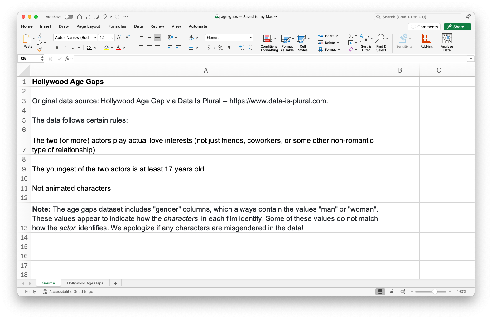
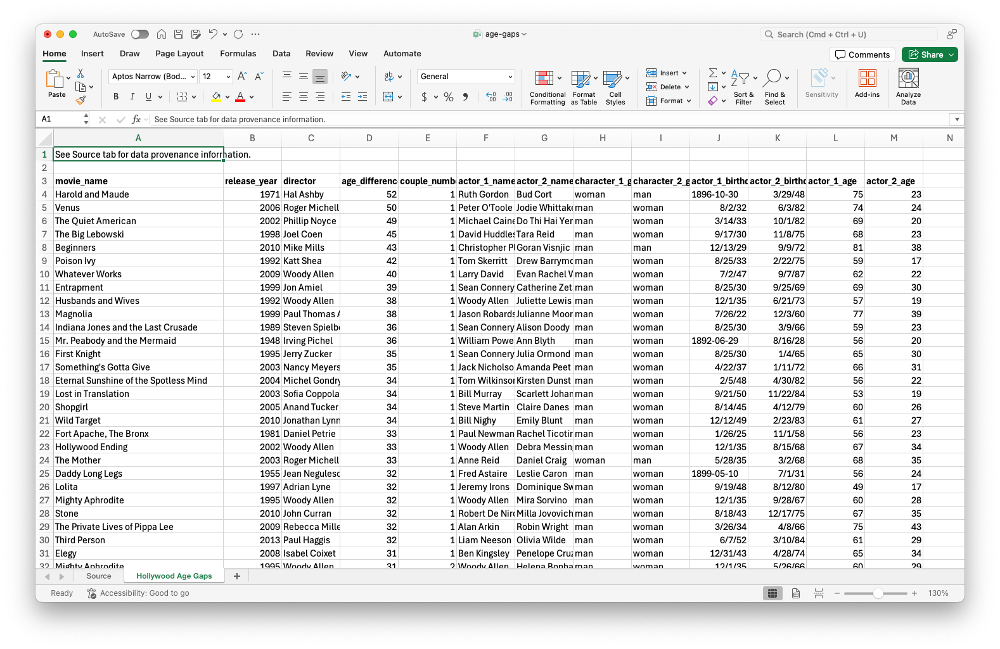

## Packages

We will use the following two packages in this application exercise.

-   **tidyverse**: For data import, wrangling, and visualization.
-   **readxl:** For importing data from Excel.

```{r}
#| label: load-packages
#| message: false
library(tidyverse)
library(readxl)
```

## Data

The data for this application exercise is from [Data is Plural](https://www.data-is-plural.com) and it is on age gaps in Hollywood relationships.

The data follows certain rules:

-   The two (or more) actors play actual love interests (not just friends, coworkers, or some other non-romantic type of relationship).
-   The youngest of the two actors is at least 17 years old.
-   Not animated characters.

The age gaps dataset includes "gender" columns, which always contain the values "man" or "woman".
These values appear to indicate how the characters in each film identify.
Some of these values do not match how the actor identifies.

The data are in an Excel file called `age-gaps.xlsx` in your `data` folder.

This is how the Excel file looks -- it has two sheets, one with the data (called `Hollywood Age Gaps`) and one with information about the data (called `Source`).
Additionally, the data sheet has some metadata at the top, above the column headers.

{width="400"} {width="400"}

## Import

Load the data from `age-gaps.xlsx` in your `data` and assign it to `age_gaps`.
Confirm that this new object appears in your Environment tab.
Click on the *name of the object* in your Environment tab to pop open the data in the data viewer.

```{r}
#| label: age-gaps-import
age_gaps <- read_excel(
  "data/age-gaps.xlsx",
  sheet = "Hollywood Age Gaps",
  skip = 2
)
```

## Subset

Create a subset of the data frame for heterosexual relationships on screen.

```{r}
#| label: age-gaps-hetero
age_gaps_heterosexual <- age_gaps |>
  filter(character_1_gender != character_2_gender)
```

Split the data for heterosexual relationships into three -- where woman is older, where man is older, where they are the same age.
Save these subsets as two appropriately named data frames.
*Remember:* Use concise and evocative names.
Confirm that these new objects appear in your Environment tab and that the sum of the number of observations in the two new data frames add to the number of observations in the original data frame.

```{r}
#| label: age-gaps-split
age_gaps_heterosexual <- age_gaps_heterosexual |>
  mutate(
    older = case_when(
      character_1_gender == "woman" & actor_1_age > actor_2_age ~ "woman older",
      character_2_gender == "woman" & actor_2_age > actor_1_age ~ "woman older",
      character_1_gender == "man"   & actor_1_age > actor_2_age ~ "man older",
      character_2_gender == "man"   & actor_2_age > actor_1_age ~ "man older",
      actor_1_age == actor_2_age ~ "same age"
    )
  )

glimpse(age_gaps_heterosexual)
```

Now let's split the data frame into separate chunks:

```{r}
woman_older <- age_gaps_heterosexual |> filter(older == "woman older")
man_older   <- age_gaps_heterosexual |> filter(older == "man older")
same_age    <- age_gaps_heterosexual |> filter(older == "same age")
```

Here's a sanity check that we did it right:

```{r}
(nrow(woman_older) + nrow(man_older) + nrow(same_age)) == nrow(age_gaps_heterosexual)
```

## Export

Write out the three new datasets you created into the `data`, and within that, into a subfolder called `age-gaps-subsets`, as CSV files.

```{r}
#| label: age-gaps-export
#| error: true
write_csv(woman_older, file = "data/woman-older.csv")
write_csv(man_older, file = "data/man-older.csv")
write_csv(same_age, file = "data/same-age.csv")
```


