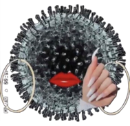
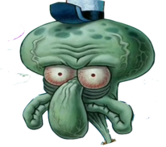

The `ggimage` package provides the `geom_image` layer and the `image` aesthetic for using image files to customize the points in a scatterplot. 

```{r}
#| warning: false
#| message: false
library(tidyverse)
library(ggimage)
```

Let's consider this cast of characters in the `images/scatter-points/` directory:






# Level 1

**Goal**: replace every point with an image of your choice.

```{r}

img <- "images/scatter-points/orange.png"

ggplot(mtcars, aes(x = wt, y = mpg)) + 
  geom_image(aes(image = img), size = 0.1)

```

I've found that the `size` argument in `geom_image` is a bit counterintuitive in its effect, so definitely tinker with that. 

# Level 2

**Goal**: adjust the image according to the value of `vs`.

```{r}

img_0 <- "images/scatter-points/squidward.png"
img_1 <- "images/scatter-points/miss-rona.png"

mtcars |>
  mutate(
    img = if_else(vs == 1, img_0, img_1)
  ) |>
  ggplot(aes(x = wt, y = mpg)) + 
  geom_image(aes(image = img), size = 0.1)

```


# Level 3

Replacing *every point* with the custom image can be computationally intensive, especially when you have a lot of points and the image file is high resolution. You can ease the burden by decreasing the size of your image file. The `magick` package makes this easy:


```{r}
#| eval: false
library(magick)

img_name <- "images/scatter-points/miss-rona.png"
img <- image_read(img_name)
img_small <- image_resize(img, "75%")
image_write(img_small, "images/scatter-points/miss-rona-small.png")
```


