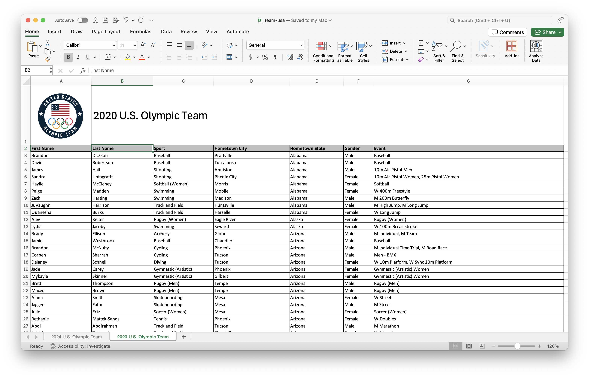
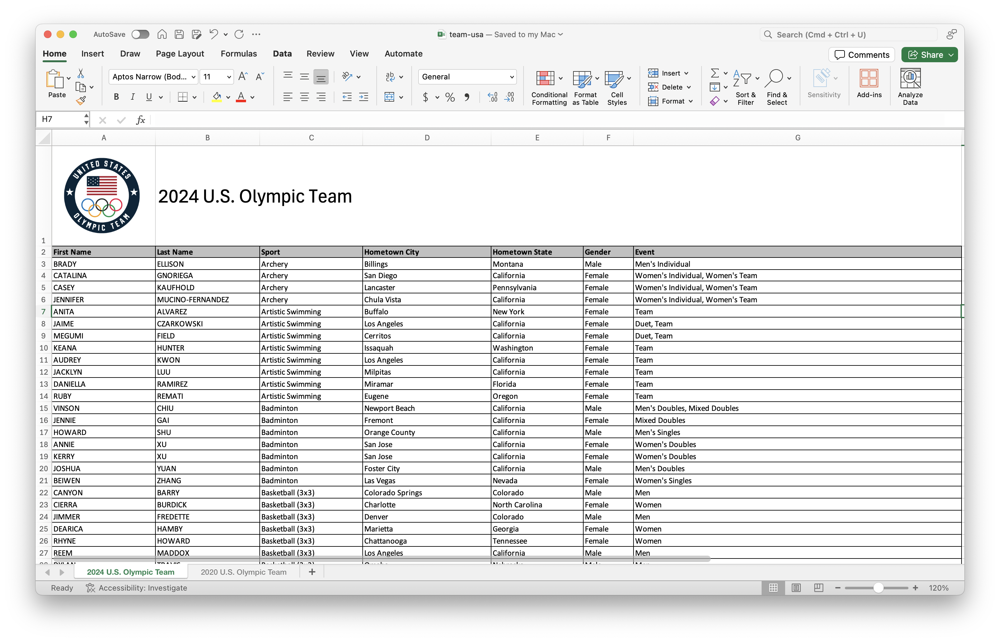

# Introduction

This is a two-part homework assignment:

- **Part 1 -- 🤖 Feedback from AI:** Not graded, for practice, you get immediate feedback with AI, based on rubrics designed by the course instructor. Complete in `hw-4-part-1.qmd`, no submission required.

  ::: {.callout-warning title="Heads up!"}
  While Part 1 is not graded, it is a prerequisite for Part 2 -- Question 6 in Part 2 asks you to summarize your experience in Part 1.
  Additionally, the skills you practice in Part 1 will be useful for future assignments that are graded.
  :::

- **Part 2 -- 🧑🏽‍🏫 Feedback from Humans:** Graded, you get feedback from the course instructional team within a week. Complete in `hw-4-part-2.qmd`, submit on Gradescope.

By now you should be familiar with how to get started with a homework assignment by cloning the GitHub repo for the assignment.

<details>
<summary>Click to expand if you need a refresher on how to get started with a homework assignment.</summary>

-   Go to <https://cmgr.oit.duke.edu/containers> and login with your Duke NetID and Password.
-   Click `STA199` under My reservations to log into your container. You should now see the RStudio environment.
-   Go to the course organization at [github.com/sta199-s26](https://github.com/sta199-s26) organization on GitHub.
    Click on the repo with the prefix **hw-4**.
    It contains the starter documents you need to complete the homework.
-   Click on the green **CODE** button, select **Use SSH**.
    Click on the clipboard icon to copy the repo URL.
-   In RStudio, go to *File* ➛ *New Project* ➛*Version Control* ➛ *Git*.
-   Copy and paste the URL of your assignment repo into the dialog box *Repository URL*. Again, please make sure to have *SSH* highlighted under *Clone* when you copy the address.
-   Click *Create Project*, and the files from your GitHub repo will be displayed in the *Files* pane in RStudio.
</details>

By now you should also be familiar with guidelines for formatting your code and plots as well as your Git and Gradescope workflow.

<details>
<summary>Click to expand if you need a refresher on assignment guidelines.</summary>

</details>


# Part 1 -- Feedback from AI

Your answers to the questions in this part should go in the file `hw-4-part-1.qmd`.

## Instructions

Write your answer to each question in the appropriate section of the `hw-4-part-1.qmd` file.
Then, highlight your answer to a question, click on _Addins > AIFEEDR > Get feedback_.
In the app that opens, select the appropriate homework number (4) and question number.
Then click on _Get Feedback_.
Please be patient, feedback generation can take a few seconds. 
Once you read the feedback, you can go back to your Quarto document to improve your answer based on the feedback. 
You will then need to click the red X on the top left corner of the Viewer pane to stop the feedback app from running before you can re-render your Quarto document.

<details>
<summary>Click to expand if you want to review the video that demonstrates how to use the AI feedback tool.</summary>

</details>

## Packages

In this part you will work with the

-   **tidyverse** package for doing data analysis in a "tidy" way and
-   **datasauRus** package for a dataset

```{r}
#| eval: true
#| message: false
library(tidyverse)
library(datasauRus)
```

## Questions

::: render-commit-push
Do not forget to render, commit, and push regularly, after each substantial change to your document (e.g., after answering each question).
Use succinct and informative commit messages.
Make sure to commit and push all changed files so that your Git pane is empty afterward.
:::

### Question 1

The data frame you will be working with for this question is called `datasaurus_dozen` and it's in the **datasauRus** package. This single data frame contains 13 datasets, designed to show us why data visualization is important and how summary statistics alone can be misleading. The different datasets are marked by the `dataset` variable, as shown in @fig-datasaurus.

{#fig-datasaurus fig-align="center" width="432"}

::: callout-note
If it's confusing that the data frame is called `datasaurus_dozen` when it contains 13 datasets, you're not alone! Have you heard of a [baker's dozen](https://www.mentalfloss.com/article/32259/why-bakers-dozen-13)?
:::

Here is a peek at the top 10 rows of the dataset:

```{r}
#| label: show-10-rows-datasaurus
#| eval: true
datasaurus_dozen
```

a.  In a single pipeline, calculate the mean of `x`, mean of `y`, standard deviation of `x`, standard deviation of `y`, and the correlation between `x` and `y` for each level of the `dataset` variable. Then, in 1-2 sentences, comment on how these summary statistics compare across groups (datasets).

::: callout-tip
There are 13 groups but `tibble`s only print out 10 rows by default. To display all rows, add `print(n = 13)` as the last step of your pipeline.
:::

b.  Create a scatterplot of `y` versus `x` and color and facet it by `dataset`. Then, in 1-2 sentences, how these plots compare across groups (datasets). How does your response in this question compare to your response to the previous question and what does this say about using visualizations and summary statistics when getting to know a dataset?

::: callout-tip
When you both color and facet by the same variable, you'll end up with a redundant legend. Turn off the legend by adding `show.legend = FALSE` to the geom creating the legend.
:::

::: render-commit-push
Render, commit, and push your changes. Make sure that you commit and push all changed documents and that your Git pane is completely empty before proceeding.
:::

### Questions 2-3

Medical marijuana in NC

#### Data

SurveyUSA polled 900 NC adults between September 4-7, 2024. Of the 900 NC adults, 771 were identified by SurveyUSA as being registered to vote.[^1] The following question was asked to these 771 adults:

[^1]: Full survey results can be found at <https://www.surveyusa.com/client/PollReport.aspx?g=c6995e17-3837-413e-ac98-3684e1c74dc1>.

> Should the use of marijuana for medical use remain against the law in North Carolina? Or be legalized?

Responses were broken down into the following categories:

| Variable | Levels                                          |
|:---------|:------------------------------------------------|
| Age      | 18-49; 50+                                      |
| Opinion  | Remain Against The Law; Be Made Legal; Not Sure |

Of the 771 responses, 391 were between the ages of 18-49. Of the individuals that are between 18-49, 59 individuals responded that they think medical marijuana should remain against the law, 292 said it should be made legal, and the remainder were not sure. Of the individuals that are 50+, 67 individuals responded that they think medical marijuana should remain against the law, 245 said it should be made legal, and the remainder were not sure.


#### Question 2

a.  Fill in the code below to create a two-way table that summarizes these data.

```{r}
#| eval: false

survey_counts <- tibble( 
  age = c(),
  opinion = c(),
  n = c()
  )

survey_counts |>
  pivot_wider( 
    names_from = ___,
    values_from = ___
  )
```

For parts b-d below, use a single pipeline starting with `survey_counts`, calculate the desired proportions, and make sure the result is an **ungrouped** data frame with a column for relevant counts, a column for relevant proportions, and a column for the groups you're interested in.

b.  Calculate the proportions of 18-49 year olds and 50+ year-olds in this sample.

c.  Calculate the proportions of those who think medical marijuana should remain against the law, should be made legal, and who are not sure.

d.  Calculate the proportions of individuals in this sample who think medical marijuana should remain against the law, should be made legal, and who are not sure

    -   among those who are 18-49 years old and
    -   among those who are 50+ years old.

#### Question 3

a.  Create a visualization that can be used to evaluate the relationship between `age` and `opinion` on legalizing medical marijuana in North Carolina based on this survey's results.

    ::: callout-tip
    Your visualization should display the proportions you calculated in Question 2d.
    :::

b.  Based on your calculations so far, as well as your visualization, write 1-2 sentences that describe the relationship, in this sample, between age and opinion on legalizing medical marijuana in North Carolina.

::: render-commit-push
Render, commit, and push your changes. Make sure that you commit and push all changed documents and that your Git pane is completely empty before proceeding.
:::

### Questions 4-5

All about Quarto

#### Question 4

You have the following code chunk:

```{r}
ggplot(penguins, aes(x = bill_length_mm, y = bill_depth_mm)) + 
  geom_point()
```

Add the following code cell options, one at a time, and set each to `false` and then to `true`. After each value, render your document and observe its effect. Ultimately, choose the values that are the most appropriate for this code cell. Based on the behaviors you observe, describe what each code cell option does.

-   `echo`

-   `warning`

-   `eval`


#### Question 5

a.  You have the following code cell again.

```{r}
ggplot(penguins, aes(x = bill_length_mm, y = bill_depth_mm)) + 
  geom_point()
```

Add `fig-width` and `fig-asp` as code chunk options. Try setting `fig-width` to values between 1 and 10. Try setting `fig-asp` to values between 0.1 and 1. Re-render the document after each value and observe its effect. Ultimately, choose values that make the plot look visually pleasing in the rendered document. Based on the behavior you observe, describe what each chunk option does.

::: callout-tip
Now that you've had more practice with figure sizing in Quarto documents, review all of the plots you made in this lab and adjust their widths and aspect rations to improve how they look in your rendered document.
:::

b\. You have the following code cell, but look carefully, it’s not exactly the same!

```{r}
#| eval: false
gplot(penguins, aes(x = bill_length_mm, y = bill_depth_mm)) + 
  geom_point()
```

Add `error` as a code chunk option and set it to `false` and then set it to `true`. After each value, render your document and observe its effect. Ultimately, choose the value that allows you to render your document without altering the code. Based on the behavior you observe, describe what this code chunk option does.

::: callout-tip
Reading [the documentation](https://quarto.org/docs/reference/formats/pdf.html#execution) might also be helpful.
:::

::: render-commit-push
Now is another good time to render, commit, and push your changes to GitHub with an informative and concise commit message.
And once again, make sure to commit and push all changed files so that your Git pane is empty afterward.
We keep repeating this because it's important and because we see students forget to do this.
So take a moment to make sure you're practicing good version control habits.
:::

# Part 2 -- Feedback from Humans

Your answers to the questions in this part should go in the file `hw-4-part-2.qmd`.

## Packages

In this part you will work with the

-   **tidyverse** package for doing data analysis in a "tidy" way,
-   **readxl** package for reading in Excel files, and
-   **janitor** package for cleaning up variable names.

You may choose to load other packages as needed, particularly for improving your plots. 
If you do so, add the functions to load these packages in the code cell labeled `load-packages`.

```{r}
library(tidyverse)
library(readxl)
library(janitor)
```

## Questions 6-7

In Questions 6 and 7, you'll work with one of the most basic and overused datasets in R: `mtcars`. The data in this dataset come from the 1974 Motor Trend US magazine (so, yes, they're old!) and provide information on fuel efficiency and other car characteristics.


### Question 6

Since the dataset is used in many code examples, it's not unexpected that some analyses of the data are good and some not so much.

::: callout-tip
For both parts of this question, you should review the data dictionary that is in the documentation for the dataset which you can find at <https://stat.ethz.ch/R-manual/R-devel/library/datasets/html/mtcars.html> or by typing `?mtcars` in your Console.
:::

a\. You come across the following visualization of these data. First, determine what is wrong with this visualization and describe it in one sentence (hint: it involves the `am` variable). Then, fix and improve the visualization. As **part** of your improvement, make sure your legend

-   is on top of the plot,
-   is informative, and
-   lists **levels** in the order they appear in the plot (from left to right).

```{r}
ggplot(mtcars, aes(x = wt, y = mpg, color = am)) +
  geom_point() +
  labs(
    x = "Weight (1000 lbs)",
    y = "Miles / gallon"
  )
```

::: callout-tip
Your answer must include all of the above code. You should add to it to make improvements, not create a completely different plot.
:::

b\. Update your plot from part (a) further, this time using different shaped points for cars with V-shaped and straight engines. Once again, some requirements for your legend – it should be informative and moved to the **right** of the plot.

### Question 7

Your task is to make your plot from Question 6b as ugly and as ineffective as possible. Like, seriously. I want something that is apocalyptically heinous, loathsome, and rotten. Change colors, axes, fonts, themes, or anything else you can think of. You can also search online for other themes, fonts, etc. that you want to tweak. The sky is truly the limit. I want Sauron, Voldemort, Cruella de Vil, Count Dracula, and Regina George all nodding in approval at how horrendous your plot is.

You must make at least 5 updates to the plot, and your answer must include:

-   a list of the at least 5 updates you've made to your plot from Question 6b, and

-   1-2 sentence explanation of why the plot you created is *ugly* (to you, at least) and ineffective.

Did I mention that the plot should be bad? A prize will be awarded for the worst submission, so get crackin'!

::: callout-tip
The tidyverse documentation on [themes](https://ggplot2.tidyverse.org/reference/theme.html) may give you ideas about how you can alter the various features of the plot. Furthermore, the solutions for AEs [5](https://sta199-s25.github.io/ae/ae-05-majors-tidy.html) and [7](https://sta199-s25.github.io/ae/ae-07-durham-climate-factors.html) demo some of the advanced layers you can add to tweak colors and positioning and so on.
:::

::: render-commit-push
Render, commit, and push your changes. Make sure that you commit and push all changed documents and that your Git pane is completely empty before proceeding.
:::

## Questions 8-9

### Data

For this part of your homework, you'll work with data from the rosters of Team USA from the 2020 and 2024 Olympics. The data come from <https://www.teamusa.com> and the rosters for the two games are in a single Excel file (`team-usa.xlsx` in your `data` folder), accross two separate spreadsheets within that file. @fig-olympics-sheets shows screenshots of these spreadsheets.

::: {#fig-olympics-sheets layout-ncol="2"}




Excel file with two sheets for rosters of Team USA 2020 and 2024.
:::

Your goal is to answer questions about athletes who competed in both games and only one of the games.

### Question 8

a.  Read data from the two sheets of `team-usa.xlsx` as two separate data frames called `team_usa_2020` and `team_usa_2024`.

::: callout-tip
The names of the sheets are shown in the screenshots in @fig-olympics-sheets, or you can use the `excel_sheets()` function to discover them. Additionally, note that the first row of the sheets contain a logo and a title describing the contents of the data, and not the header row containing variable names.
:::

b.  Read the documentation for the `clean_names()` function from the **janitor** package at <https://sfirke.github.io/janitor/reference/clean_names.html>. Use this function to "clean" the variable names of `team_usa_2020` and `team_usa_2024` and save the data frames with the new variable names.

c.  Create a new variable in both of the datasets called `name` that:

    -   `paste()`s together the `first_name` and `last_name` variables with a space in between and
    -   is the first variable in the resulting data frame.

d.  Using the appropriate `*_join()` function, determine how many athletes participated in both Olympic Games?

::: callout-important
Your answer to this question, based on the data frames you created, should be 0, even if it doesn't make sense in context of actual Olympic athletes.
:::

### Question 9

If you have even a passing knowledge of the Olympic Games, you might know that there are some athletes that participated in both the 2020 and 2024 games, e.g., Simone Biles, Katie Ledecky, etc.

a.  The reason why athlete names didn't match across the two data frames is that in one data frame, names are in UPPER CASE, and in the other, they're in Title Case. Update the 2020 data frame to make `name` all upper case. Display the first 10 rows of `team_usa_2020` with upper case names.

::: callout-important
Your answer must use the `str_to_upper()` function.
:::

b.  Let's try that question again: How many athletes participated in both Olympic Games?

c.  How many athletes participated in the 2020 Olympic Games but not the 2024 Olympic Games? How many athletes participated in the 2024 Olympic Games but not the 2020 Olympic Games?

::: render-commit-push
Render, commit, and push your changes. Make sure that you commit and push all changed documents and that your Git pane is completely empty before proceeding.
:::

### Question 10

MTK: NEED ONE MORE render-commit-push (maybe add one after Q6?)

::: render-commit-push
Render, commit, and push your changes. Make sure that you commit and push all changed documents and that your Git pane is completely empty before proceeding.
:::

# Wrap-up

::: callout-warning
Before you wrap up the assignment, make sure that you render, commit, and push one final time so that the final versions of both your `.qmd` file and the rendered PDF are pushed to GitHub and your Git pane is empty.
We will be checking these to make sure you have been practicing how to commit and push changes.
:::

## Submission



## Grading and feedback

-   Questions 1-5 are not graded, but you should complete them to get practice.

-   Questions 6-10 are graded, and you will receive feedback on Gradescope from the course instructional team within a week.
    -   Questions will be graded for accuracy and completeness.
    -   Partial credit will be given where appropriate.
    -   There are also workflow points for:
        - committing at least three times as you work through your homework,
        - having your final version of `.qmd` and `.pdf` files in your GitHub repository, and
        - overall organization.