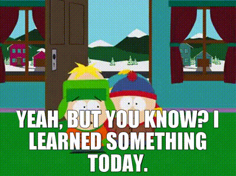
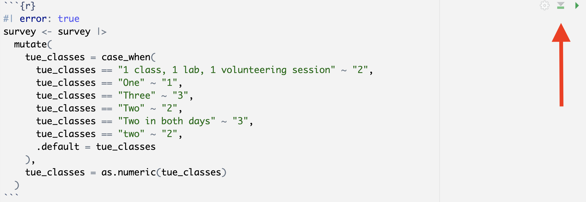

I made a lulu in lecture on Monday February 9, and I know you folks have encountered similar snags on HW, so let's unpack it. 

## Background

I was cleaning this dataset:

```{r}
#| message: false
library(tidyverse)
survey <- read_csv("data/survey-2026-02-09.csv") |>
  rename(
    tue_classes = `How many classes do you have on Tuesdays?`,
    year = `What year are you?`
  )
survey
```

Why does it need cleaning? Because I asked you jamokes "How many classes do you have on Tuesdays?" and some folks responded with their life's story: 

```{r}
survey |>
  count(tue_classes)
```

And thank goodness you did! There would have been no lesson otherwise. Anyway, the end goal is to clean up the `tue_classes` column so that it is literally a column of numbers instead of a column of text. I demo-ed this in phases. 

## The first thing I ran

I knew this wouldn't work:

```{r}
#| error: true
survey <- survey |>
  mutate(
    tue_classes = case_when(
      tue_classes == "1 class, 1 lab, 1 volunteering session" ~ 2,
      tue_classes == "One" ~ 1,
      tue_classes == "Three" ~ 3,
      tue_classes == "Two" ~ 2,
      tue_classes == "Two in both days" ~ 3,
      tue_classes == "two" ~ 2,
      .default = tue_classes
    )
  )
```

That error message is actually pretty good. It's saying inside `mutate` and inside `case_when`, there was an error because you can't combine type `<double>` and type `character`. All true. The columns of a data frame are just *vectors* in `R`, and vectors need to contain values of all the same type. You can't mix and match. Our `case_when` statement is saying "in the six weird cases, make `tue_classes` and number(`1`, `2`, etc), and in all other cases (`.default`), keep it the way it is." Well, `tue_classes` comes to us as type `<character>`, so our original attempt at `case_when` is effectively asking the computer to mix and match types, which is forbidden. So we moved on...

## The second thing I ran

```{r}
#| error: true
survey <- survey |>
  mutate(
    tue_classes = case_when(
      tue_classes == "1 class, 1 lab, 1 volunteering session" ~ "2",
      tue_classes == "One" ~ "1",
      tue_classes == "Three" ~ "3",
      tue_classes == "Two" ~ "2",
      tue_classes == "Two in both days" ~ "3",
      tue_classes == "two" ~ "2",
      .default = tue_classes
    )
  )
```

No error! And now take a look:

```{r}
glimpse(survey)
```

```{r}
survey |>
  count(tue_classes)
```

We've cleaned up all of those goofy cases. Everything *appears* as a numeral, but the column is still type `character`. To wrap up, we need to convert using `as.numeric`.

## The third thing I ran

```{r}
#| error: true
survey <- survey |>
  mutate(
    tue_classes = case_when(
      tue_classes == "1 class, 1 lab, 1 volunteering session" ~ "2",
      tue_classes == "One" ~ "1",
      tue_classes == "Three" ~ "3",
      tue_classes == "Two" ~ "2",
      tue_classes == "Two in both days" ~ "3",
      tue_classes == "two" ~ "2",
      .default = tue_classes
    ),
    tue_classes = as.numeric(tue_classes)
  )
```

No error! And now take a look:

```{r}
glimpse(survey)
```

```{r}
survey |>
  count(tue_classes)
```

...Okay. So why did JZ stand there for what felt like an eternity looking like a chinless fool? Because dear students, he made the mistake of running that same exact same chunk of (correct!) code again.

## The fourth thing I (mistakenly) ran

It's the exact same code as before. I just hit "Run" on the code chunk a second time:

```{r}
#| error: true
survey <- survey |>
  mutate(
    tue_classes = case_when(
      tue_classes == "1 class, 1 lab, 1 volunteering session" ~ "2",
      tue_classes == "One" ~ "1",
      tue_classes == "Three" ~ "3",
      tue_classes == "Two" ~ "2",
      tue_classes == "Two in both days" ~ "3",
      tue_classes == "two" ~ "2",
      .default = tue_classes
    ),
    tue_classes = as.numeric(tue_classes)
  )
```

*WTF*? It was just working a second ago. Exactly. `survey` is currently exactly how I want it:

```{r}
glimpse(survey)
```

So, if I unnecessarily rerun that code a second time, I am now applying it to the new and improved data frame where `tue_classes` is numeric type. But that means when I apply the `case_when` statement, I'm mixing types again! Before, the types got mixed up because `tue_classes` was character type and I was trying to convert the special cases to numbers. Now, the types get mixed up because `tue_classes` is numeric type and I am trying to convert the special cases to characters. 

## The Full Monty

When I re-ran the whole darn thing from scratch as Sarah and Hyunjin suggested, we're all good again:

```{r}
#| message: false
survey <- read_csv("data/survey-2026-02-09.csv") |>
  rename(
    tue_classes = `How many classes do you have on Tuesdays?`,
    year = `What year are you?`
  )

survey <- survey |>
  mutate(
    tue_classes = case_when(
      tue_classes == "1 class, 1 lab, 1 volunteering session" ~ "2",
      tue_classes == "One" ~ "1",
      tue_classes == "Three" ~ "3",
      tue_classes == "Two" ~ "2",
      tue_classes == "Two in both days" ~ "3",
      tue_classes == "two" ~ "2",
      .default = tue_classes
    ),
    tue_classes = as.numeric(tue_classes)
  )
```

No error!

```{r}
glimpse(survey)

survey |>
  count(tue_classes)
```

## What's it all about, Alfie?

{fig-align="center"}

- If you have a chunk of code that transforms a data frame and overwrites it, you might get some strange behavior if you try to run it multiple times without thinking. The first time you run it, it may do what you want, but if you run it a second or third time, you aren't applying your changes to the original object that you intended. You are applying them to the modified version after the first run;
- This is only a problem when you're running code chunks à la carte in the editor. What truly matters is what happens when you render your document, because that's the final product you will actually submit. In my case, re-rendering the slides would have worked great, because all the code chunks are being run *once* in sequence;
- When in doubt, before (re)running a code chunk in isolation, run all of the code chunks above it, *in sequence*. That will often reset your environment to the state it will be in just before the code you are working on, and then you can see if it's working how you want. To "run all code chunks above this one," click the second button in the upper right of the current code chunk:

{fig-align="center"}
