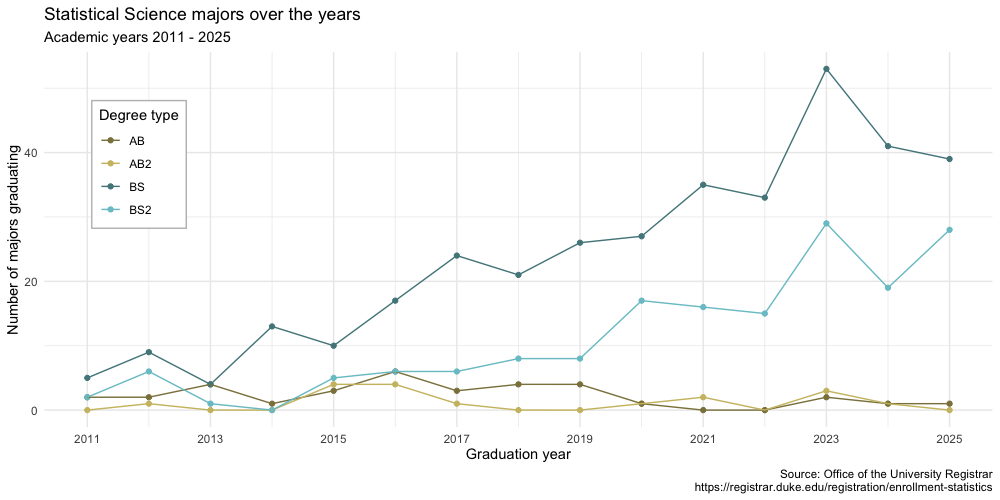

# Warm-up

## While you wait... {.smaller}

<!-- begin: ae definition -->

```{r}
#| include: false
library(tidyverse)
library(usdata)
todays_ae <- "ae-06-majors-tidy"
```

<!-- end: ae definition -->

Prepare for today's application exercise: **`{r} todays_ae`**

::: appex
-   Go to your `ae` project in RStudio.

-   Make sure all of your changes up to this point are committed and pushed, i.e., there's nothing left in your Git pane.

-   Click Pull to get today's application exercise file: *`{r} paste0(todays_ae, ".qmd")`*.

-   Wait till the you're prompted to work on the application exercise during class before editing the file.
:::

## Miscellany: logical operators

Generally useful in a `filter()` but will come up in various other places as well...

| operator | definition                                |
|:---------|:------------------------------------------|
| `<`      | [is less than?]{.fragment}                |
| `<=`     | [is less than or equal to?]{.fragment}    |
| `>`      | [is greater than?]{.fragment}             |
| `>=`     | [is greater than or equal to?]{.fragment} |
| `==`     | [is exactly equal to?]{.fragment}         |
| `!=`     | [is not equal to?]{.fragment}             |

: {tbl-colwidths="\[25,75\]"}

## Miscellany: logical operators (cont.) {.medium}

Generally useful in a `filter()` but will come up in various other places as well...

| operator      | definition                                                            |
|:-----------------|:-----------------------------------------------------|
| `x & y`       | [is x AND y?]{.fragment}                                              |
| `x | y`       | [is x OR y?]{.fragment}                                               |
| `is.na(x)`    | [is x NA?]{.fragment}                                                 |
| `!is.na(x)`   | [is x not NA?]{.fragment}                                             |
| `x %in% y`    | [is x in y?]{.fragment}                                               |
| `!(x %in% y)` | [is x not in y?]{.fragment}                                           |
| `!x`          | [is not x? (only makes sense if `x` is `TRUE` or `FALSE`)]{.fragment} |

: {tbl-colwidths="\[25,75\]"}

## Miscellany: assignment

Let's make a tiny data frame to use as an example:

```{r}
df <- tibble(x = c(1, 2, 3, 4, 5), y = c("a", "a", "b", "c", "c"))
df
```

## Miscellany: assignment

::: question
Suppose you run the following and **then** you inspect `df`, will the `x` variable have values 1, 2, 3, 4, 5 or 2, 4, 6, 8, 10?
:::

::: columns
::: column
```{r}
df |>
  mutate(x = x * 2)
```
:::

::: column
```{r}
#| eval: false
df
```
:::
:::

## Miscellany: assignment

::: question
Suppose you run the following and **then** you inspect `df`, will the `x` variable have values 1, 2, 3, 4, 5 or 2, 4, 6, 8, 10?
:::

::: columns
::: column
```{r}
df |>
  mutate(x = x * 2)
```
:::

::: column
```{r}
df
```
:::
:::

. . .

> **Do something and show me**

## Miscellany: assignment

::: question
Suppose you run the following and **then** you inspect `df`, will the `x` variable has values 1, 2, 3, 4, 5 or 2, 4, 6, 8, 10?
:::

::: columns
::: column
```{r}
df <- df |>
  mutate(x = x * 2)
```
:::

::: column
```{r}
#| eval: false
df
```
:::
:::

## Miscellany: assignment

::: question
Suppose you run the following and **then** you inspect `df`, will the `x` variable has values 1, 2, 3, 4, 5 or 2, 4, 6, 8, 10?
:::

::: columns
::: column
```{r}
#| eval: false
df <- df |>
  mutate(x = x * 2)
```
:::

::: column
```{r}
df
```
:::
:::

. . .

> **Do something and save result**

## Miscellany: assignment {.smaller}

::: columns
::: {.column .fragment width="49%"}
> **Do something, save result, overwriting original**

```{r}
#| code-line-numbers: "5-7"

df <- tibble(
  x = c(1, 2, 3, 4, 5), 
  y = c("a", "a", "b", "c", "c")
)
df <- df |>
  mutate(x = x * 2)
df
```
:::

::: {.column .fragment width="49%"}
> **Do something, save result, *not* overwriting original**

```{r}
#| code-line-numbers: "5-7"

df <- tibble(
  x = c(1, 2, 3, 4, 5), 
  y = c("a", "a", "b", "c", "c")
)
df_new <- df |>
  mutate(x = x * 2)
df_new
```
:::
:::

## Miscellany: assignment {.smaller}

::: columns
::: {.column .fragment width="49%"}
> **Do something, save result, overwriting original *when you shouldn't***

```{r}
#| code-line-numbers: "5-8"

df <- tibble(
  x = c(1, 2, 3, 4, 5), 
  y = c("a", "a", "b", "c", "c")
)
df <- df |>
  group_by(y) |>
  summarize(mean_x = mean(x))
df
```
:::

::: {.column .fragment width="49%"}
> **Do something, save result, *not* overwriting original *when you shouldn't***

```{r}
#| code-line-numbers: "5-8"

df <- tibble(
  x = c(1, 2, 3, 4, 5), 
  y = c("a", "a", "b", "c", "c")
)
df_summary <- df |>
  group_by(y) |>
  summarize(mean_x = mean(x))
df_summary
```
:::
:::

## Miscellany: assignment {.smaller}

::: columns
::: {.column .fragment width="49%"}
> **Do something, save result, overwriting original**\
> ***data frame***

```{r}
#| code-line-numbers: "5-7"

df <- tibble(
  x = c(1, 2, 3, 4, 5), 
  y = c("a", "a", "b", "c", "c")
)
df <- df |>
  mutate(z = x + 2)
df
```
:::

::: {.column .fragment width="49%"}
> **Do something, save result, overwriting original**\
> ***column***

```{r}
#| code-line-numbers: "5-7"

df <- tibble(
  x = c(1, 2, 3, 4, 5), 
  y = c("a", "a", "b", "c", "c")
)
df <- df |>
  mutate(x = x + 2)
df
```
:::
:::

## Last time {.small}

We had to mutate before plotting. Two methods:

::: columns
::: {.column .fragment width="50%"}
Do it all at once and don't store:

```{r}
gerrymander |>
  mutate(flip18 = as_factor(flip18)) |>
  ggplot(aes(x = gerry, fill = flip18)) +
  geom_bar(position = "fill")
```
:::

::: {.column .fragment width="50%"}
Mutate, store change, then plot

```{r}
gerrymander <- gerrymander |>
  mutate(flip18 = as_factor(flip18))

ggplot(gerrymander, aes(x = gerry, fill = flip18)) +
  geom_bar(position = "fill")
```
:::

:::

## A common mistake

Why is this a travesty?

```{r}
gerrymander <- gerrymander |>
  mutate(flip18 = as_factor(flip18)) |>
  ggplot(aes(x = gerry, fill = flip18)) +
  geom_bar(position = "fill")
```

## The data are lost!

`gerrymander` is no longer a data frame. It's a plot...thing:

```{r}
#| error: true
gerrymander |>
  filter(state == "TX")
```

# Data tidying

## Tidy data

> "Tidy datasets are easy to manipulate, model and visualise, and have a specific structure: each variable is a column, each observation is a row, and each type of observational unit is a table."
>
> Tidy Data, <https://vita.had.co.nz/papers/tidy-data.pdf>

. . .

**Note:** "easy to manipulate" = "straightforward to manipulate"

## Goal

Visualize StatSci majors over the years!




## Data {.smaller}

```{r}
statsci <- read_csv("data/statsci_clean.csv")
statsci
```

-   The first column (variable) is the `degree`, and there are 4 possible degrees: BS (Bachelor of Science), BS2 (Bachelor of Science, 2nd major), AB (Bachelor of Arts), AB2 (Bachelor of Arts, 2nd major).

-   The remaining columns show the number of students graduating with that major in a given academic year from 2011 to 2024.

## Let's plan! {.smaller .nostretch}

In a perfect world, how would our data be formatted to create this plot? What do the columns need to be? What would go inside `aes` when we call `ggplot`?


## The goal

We want to be able to write code that starts something like this:

```{r}
#| eval: false 
ggplot(statsci, aes(x = year, y = n, color = degree_type)) + 
  ...
```

But the data are not in a format that will allow us to do that.

## The challenge {.smaller .scrollable}

::: columns
::: {.column .fragment width="69%"}
> How do we go from this...

```{r}
#| echo: false

statsci |>
  select(degree_type, `2011`, `2012`, `2013`, `2014`, `2015`, `2016`, `2017`)
```
:::

::: {.column .fragment width="29%"}
> ...to this?

```{r}
#| echo: false

statsci |>
  pivot_longer(
    cols = -degree_type,
    names_to = "year",
    names_transform = as.numeric,
    values_to = "n"
  ) |>
  select(degree_type, year, n) |>
  print(n = 16)
```
:::
:::

. . .

With the command `pivot_longer()`!

## `pivot_longer()` {.smaller .scrollable}

::: task
Pivot the `statsci` data frame *longer* such that each row represents a degree type / year combination and `year` and `n`umber of graduates for that year are columns in the data frame.
:::

```{r}
statsci |>
  pivot_longer(
    cols = -degree_type,
    names_to = "year",
    values_to = "n"
  )
```

## `year`

::: question
What is the type of the `year` variable?
Why?
What should it be?
:::

. . .

It's a character (`chr`) variable since the information came from the columns of the original data frame and R cannot know that these character strings represent years.
The variable type should be numeric.

## `pivot_longer()` again {.smaller .scrollable}

::: question
Start over with pivoting, and this time also make sure `year` is a numerical variable in the resulting data frame.
:::

```{r}
statsci |>
  pivot_longer(
    cols = -degree_type,
    names_to = "year",
    values_to = "n",
    names_transform = as.numeric,
  )
```

## `NA` counts

::: question
What does an `NA` mean in this context?
*Hint:* The data come from the university registrar, and they have records on every single graduates, there shouldn't be anything "unknown" to them about who graduated when.
:::

. . .

`NA`s should actually be 0s.

## Clean-up {.smaller .scrollable}

::: task
Add on to your pipeline that you started with pivoting and convert `NA`s in `n` to `0`s.
:::

```{r}
statsci |>
  pivot_longer(
    cols = -degree_type,
    names_to = "year",
    names_transform = as.numeric,
    values_to = "n"
  ) |>
  mutate(n = if_else(is.na(n), 0, n))
```

## Finish {.smaller .scrollable}

::: task
Now that you have your data pivoting and cleaning pipeline figured out, save the resulting data frame as `statsci_longer`.
:::

```{r}
statsci_longer <- statsci |>
  pivot_longer(
    cols = -degree_type,
    names_to = "year",
    names_transform = as.numeric,
    values_to = "n"
  ) |>
  mutate(n = if_else(is.na(n), 0, n))
```

## `{r} todays_ae`

::: appex
-   Go to your ae project in RStudio.

-   If you haven't yet done so, make sure all of your changes up to this point are committed and pushed, i.e., there's nothing left in your Git pane.

-   If you haven't yet done so, click Pull to get today's application exercise file: *`{r} paste0(todays_ae, ".qmd")`*.

-   Work through the application exercise in class, and render, commit, and push your edits by the end of class.
:::

# Pivot Wider

## We pivotted longer... what about wider? {.smaller}

::: columns
::: {.column width="65%"}
```{r}
#| echo: false
cat("# A tibble: 4 x 16")
statsci |> 
  select(1:10) |> 
  as.data.frame()
```

::: {.task .fragment}
Can we go the other direction?
:::
:::

::: {.column width="5%"}
⟵
:::

::: {.column width="30%"}
```{r}
#| echo: false
cat("# A tibble: 60 x 3")
print(statsci |>
        pivot_longer(
    cols = -degree_type,
    values_to = "n",
    names_to = "year",
    names_transform = as.numeric) |>
      slice_head(n = 17) |>
        as.data.frame())
```
:::
:::

## We pivotted longer... what about wider? {.smaller}

::: columns
::: {.column width="65%"}
```{r}
#| echo: false
cat("# A tibble: 4 x 16")
statsci |> 
  select(1:10) |> 
  as.data.frame()
```

::: task
```{r}
#| eval: false
statsci_longer |> 
  pivot_wider(
    names_from = ____________ ,
    
    values_from = ___________ , 
  )
```
:::
:::

::: {.column width="5%"}
⟵
:::

::: {.column width="30%"}
```{r}
#| echo: false
cat("# A tibble: 60 x 3")
print(statsci |>
        pivot_longer(
    cols = -degree_type,
    values_to = "n",
    names_to = "year",
    names_transform = as.numeric) |>
      slice_head(n = 17) |>
        as.data.frame())
```
:::
:::

##  {.smaller}

{fig-align="center"}

## Recap: Pivot {.smaller}

::: incremental
-   ***When should you pivot?*** If all of the data you need is in your data frame, but the columns you need don't exist, there is a good chance it's time to pivot!
-   ***Wide and long:*** Data sets can't be labeled as *wide* or *long* but they can be made *wider* or *longer* for a certain analysis that requires a certain format
-   ***Pivot longer - data type:*** When pivoting longer, variable names that turn into values are characters by default. If you need them to be in another format, you need to explicitly make that transformation, which you can do so within the `pivot_longer()` function.
:::

## Recap: Plotting {.smaller}

::: incremental
-   You can tweak a plot forever, but at some point the tweaks are likely not very productive.

-   However, you should always be critical of defaultsand see if you can improve the plot to better portray your data / results / what you want to communicate.
:::


