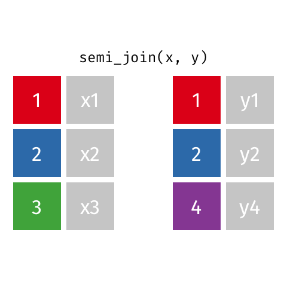

## While you wait... {.smaller}

<!-- begin: ae definition -->

```{r}
#| include: false
library(tidyverse)
todays_ae <- "ae-07-taxes-join"
```

<!-- end: ae definition -->

Prepare for today's application exercise: **`{r} todays_ae`**

::: appex
-   Go to your `ae` project in RStudio.

-   Make sure all of your changes up to this point are committed and pushed, i.e., there's nothing left in your Git pane.

-   Click Pull to get today's application exercise file: *`{r} paste0(todays_ae, ".qmd")`*.

-   Wait till the you're prompted to work on the application exercise during class before editing the file.
:::

## Support your classmates this weekend!

::: columns
::: {.column width="40%"}

:::

::: {.column width="60%"}
- Paige Auditorium;
- Friday and Saturday @ 7pm;
- STAWANANA students in...
  - Duke Chinese Dance
  - Temptasians
  - Defining Movement
  - Club Taekwondo
  - (what else?)
:::
:::

# Recap: pivoting

##  {.smaller}

{fig-align="center"}

# Recoding data

## What's going on in this plot? {.smaller}

::: question
Can you guess the variable plotted here?
:::

```{r}
#| echo: false
#| message: false
library(usmap)
library(scales)
library(scico)

states <- us_map(regions = "states")

sales_taxes <- read_csv("data/sales-taxes-25.csv")
  
states_sales_taxes <- states |>
  left_join(sales_taxes, join_by(full == state))

ggplot(states_sales_taxes) + 
  geom_sf(aes(fill = state_tax_rate)) +
  scale_fill_scico(
    palette = "oslo",
    labels = label_percent(accuracy = 0.01)
  ) +
  theme_void() +
  coord_sf() +
  labs(fill = NULL)
```

## Sales taxes in US states {.smaller}

```{r}
sales_taxes
```

## Sales tax in swing states {.smaller}

::: question
Suppose you're tasked with the following:

> Compare the average state sales tax rates of swing states (Arizona, Georgia, Michigan, Nevada, North Carolina, Pennsylvania, and Wisconsin) vs. non-swing states.

How would you approach this task?
:::

. . .

-   Create a new variable called `swing_state` with levels `"Swing"` and `"Non-swing"`
-   Group by `swing_state`
-   Summarize to find the mean sales tax in each type of state

## `{r} todays_ae` {.smaller}

::: appex
-   Go to your ae project in RStudio.

-   If you haven't yet done so, make sure all of your changes up to this point are committed and pushed, i.e., there's nothing left in your Git pane.

-   If you haven't yet done so, click Pull to get today's application exercise file: *`{r} paste0(todays_ae, ".qmd")`*.

-   Work through the application exercise in class, and render, commit, and push your edits by the end of class.
:::

## `mutate()` with `if_else()` {.smaller .scrollable}

::: task
Create a new variable called `swing_state` with levels `"Swing"` and `"Non-swing"`.
:::

```{r}
list_of_swing_states <- c("Arizona", "Georgia", "Michigan", "Nevada", 
                          "North Carolina", "Pennsylvania", "Wisconsin")

sales_taxes <- sales_taxes |>
  mutate(
    swing_state = if_else(state %in% list_of_swing_states,
                          "Swing",
                          "Non-swing")) |>
  relocate(swing_state)

sales_taxes
```

## Recap: `if_else()`

``` r
if_else(
  x == y,               #<1>
  "x is equal to y",    #<2>
  "x is not equal to y" #<3>
)
```

1.  Condition
2.  Value if condition is `TRUE`
3.  Value if condition is `FALSE`

## Participate 📱💻 {.smaller}


::: wooclap
Fill in the blank to compare the average state sales tax rates of swing states vs. non-swing states.

```{r}
#| eval: false
sales_taxes |>
  __BLANK__ |>
  summarize(mean_state_tax = mean(state_tax_rate))
```

::: wooclap-choices
- `arrange(swing_state)`
- `filter(swing_state == "Swing")`
- `group_by(swing_state)`
- `group_by(list_of_swing_states)`
:::

:::


## Sales tax in swing states {.smaller .scrollable}

::: task
Compare the average state sales tax rates of swing states vs. non-swing states.
:::

```{r}
sales_taxes |>
  group_by(swing_state) |>
  summarize(mean_state_tax = mean(state_tax_rate))
```

## Sales tax in coastal states {.smaller}

::: question
Suppose you're tasked with the following:

> Compare the average state sales tax rates of states on the Pacific Coast, states on the Atlantic Coast, and the rest of the states.

How would you approach this task?
:::

. . .

-   Create a new variable called `coast` with levels `"Pacific"`, `"Atlantic"`, and `"Neither"`
-   Group by `coast`
-   Summarize to find the mean sales tax in each type of state

## `mutate()` with `case_when()` {.smaller .scrollable}

::: task
Create a new variable called `coast` with levels `"Pacific"`, `"Atlantic"`, and `"Neither"`.
:::

```{r}
pacific_coast <- c("Alaska", "Washington", "Oregon", "California", "Hawaii")

atlantic_coast <- c(
  "Connecticut", "Delaware", "Georgia", "Florida", "Maine", "Maryland", 
  "Massachusetts", "New Hampshire", "New Jersey", "New York", 
  "North Carolina", "Rhode Island", "South Carolina", "Virginia"
)

sales_taxes <- sales_taxes |>
  mutate(
    coast = case_when(
      state %in% pacific_coast ~ "Pacific",
      state %in% atlantic_coast ~ "Atlantic",
      .default = "Neither"
    )
  ) |>
  relocate(coast)

sales_taxes
```

## Recap: `case_when()`

``` r
case_when(
  x > y  ~ "x is greater than y", #<1>
  x < y  ~ "x is less than y",    #<2>
  .default = "x is equal to y"    #<3>  
)
```

1.  Value if first condition is `TRUE`
2.  Value if second condition is `TRUE`
3.  Value if neither condition is `TRUE`, i.e., default value

## Sales tax in coastal states {.smaller .scrollable}

::: task
Compare the average state sales tax rates of states on the Pacific Coast, states on the Atlantic Coast, and the rest of the states.
:::

```{r}
sales_taxes |>
  group_by(coast) |>
  summarize(mean_state_tax = mean(state_tax_rate))
```

## Sales tax in US regions {.smaller}

::: question
Suppose you're tasked with the following:

> Compare the average state sales tax rates of states in various regions (Midwest - 12 states, Northeast - 9 states, South - 16 states, West - 13 states).

How would you approach this task?
:::

. . .

-   Create a new variable called `region` with levels `"Midwest"`, `"Northeast"`, `"South"`, and `"West"`.
-   Group by `region`
-   Summarize to find the mean sales tax in each type of state

## `mutate()` with `case_when()` {.smaller .scrollable}

::: question
Who feels like filling in the blanks lists of states in each region? Who feels like it's simply too tedious to write out names of all states?
:::

```{r}
#| eval: false
list_of_midwest_states <- c(___)
list_of_northeast_states <- c(___)
list_of_south_states <- c(___)
list_of_west_states <- c(___)

sales_taxes <- sales_taxes |>
  mutate(
    coast = case_when(
      state %in% list_of_west_states ~ "Midwest",
      state %in% list_of_northeast_states ~ "Northeast",
      state %in% list_of_south_states ~ "South",
      state %in% list_of_west_states ~ "West"
    )
  )
```

# Joining data

## Why join? {.smaller}

Suppose we want to answer questions like:

> Is there a relationship between\
> - number of QS courses taken\
> - having scored a 4 or 5 on the AP stats exam\
> - motivation for taking course\
> - ...\
> and performance in this course?"

. . .

Each of these would require *join*ing class performance data with an outside data source so we can have all relevant information (columns) in a single data frame.

## Why join? {.smaller}

Suppose we want to answer questions like:

> Compare the average state sales tax rates of states in various regions (Midwest - 12 states, Northeast - 9 states, South - 16 states, West - 13 states).

. . .

This can also be solved with *join*ing region information with the state-level sales tax data.

## Setup

For the next few slides...

::: columns
::: {.column width="50%"}
```{r}
x <- tibble(
  id = c(1, 2, 3),
  value_x = c("x1", "x2", "x3")
  )

x
```
:::

::: {.column width="50%"}
```{r}
y <- tibble(
  id = c(1, 2, 4),
  value_y = c("y1", "y2", "y4")
  )

y
```
:::
:::

## `left_join()`

::: columns
::: {.column width="50%"}

:::

::: {.column width="50%"}
```{r}
left_join(x, y)
```
:::
:::

## `right_join()`

::: columns
::: {.column width="50%"}

:::

::: {.column width="50%"}
```{r}
right_join(x, y)
```
:::
:::

## `full_join()`

::: columns
::: {.column width="50%"}

:::

::: {.column width="50%"}
```{r}
full_join(x, y)
```
:::
:::

## `inner_join()`

::: columns
::: {.column width="50%"}

:::

::: {.column width="50%"}
```{r}
inner_join(x, y)
```
:::
:::

## `semi_join()`

::: columns
::: {.column width="50%"}

:::

::: {.column width="50%"}
```{r}
semi_join(x, y)
```
:::
:::

## `anti_join()`

::: columns
::: {.column width="50%"}

:::

::: {.column width="50%"}
```{r}
anti_join(x, y)
```
:::
:::

## Summary

{fig-align="center"}
