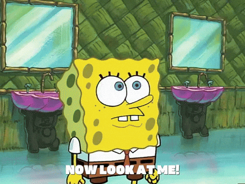

# Warm up

## While you wait: Participate 📱💻 {.small}

```{r}
#| include: false
library(tidyverse)
durham_climate <- read_csv("data/durham-climate.csv")
```

::: columns

::: {.column width="70%"}

::: wooclap

If you create a factor variable, but you do no explicitly give the levels of your factor an order, what default does R apply?

::: wooclap-choices
- chronological;
- the order in which the levels first appear in the data frame;
- alphabetical;
- no default. it will throw an error.
:::

:::

:::

::: {.column width="30%"}

:::

:::

## Midterm 1

. . .

It's two weeks from today!

. . .

I'll say more next week when I post the study guide.

## Project starts next Thursday {.small .scrollable}

::: incremental
- 15% of your final course grade;
- Instructor randomly assign teams *within lab*, taking into account the domain interests (econ, health, sports, etc) you expressed on the "Getting to Know You" survey:
- Important dates:
    - Thu Feb 19 - how to collaborate with git/github, start proposal;
    - Sun Feb 22 - submit proposal;
    - Thu Feb 26 - work period;
    - Thu Mar 5 - peer review, work period
    - Thu Mar 26 - final presentation;
    - Sun Mar 29 - final submission. 
- You will evaluate your peers throughout, and good collaboration is part of the project grade.
:::


## GitHub workflow

Render, Commit, and Push early and often! We actually assign points to this on lab and HW:

- At least 3 commits to .qmd file:    (out of 3 points)
- At least 1 commit to .pdf file:     (out of 2 points)
- Git email correctly configured:     (out of 2 points)

## GitHub workflow

As a courtesy to your teammates, practice good habits!

::: incremental
- Render: make sure your stuff actually runs without error. People get mad if you send them errors;
- Commit: leave a well-documented trail of breadcrumbs so that teammates (and your future self!) know what you changed and why;
- Push: backup your work in the cloud (GitHub) so it isn't lost.
:::

## Code smell {.small}

> One way to look at smells is with respect to principles and quality: "Smells are certain structures in the code that indicate violation of fundamental design principles and negatively impact design quality". Code smells are usually not bugs; they are not technically incorrect and do not prevent the program from functioning. Instead, they indicate weaknesses in design that may slow down development or increase the risk of bugs or failures in the future.

{width="319" fig-align="center"} {fig-align="center"} {width="319" fig-align="center"}

::: aside
Source: [Code smell on Wikipedia](https://en.wikipedia.org/wiki/Code_smell)
:::


## Code style

Follow the [Tidyverse style guide](https://style.tidyverse.org/):

-   Spaces before and line breaks after each `+` when building a ggplot

-   Spaces before and line breaks after each `|>` in a data transformation pipeline,

-   Proper indentation

-   Spaces around `=` signs and spaces after commas

-   Lines should not span more than 80 characters, long lines should be broken up with each argument on its own line

# FAQ

## Quotes VS no quotes VS backticks

. . .

```{r}
df <- tibble(
  x = c(-2, -0.5, 0.5, 1, 2),
  `2011` = c(-2, -0.5, 0.5, 1, 2),
  `my var` = c(-2, -1, 0, 1, 2)
)
df
```

## Quotes VS no quotes VS backticks {.small .scrollable}

```{r}
df <- tibble(
  x = c(-2, -0.5, 0.5, 1, 2),
  `2011` = c(-2, -0.5, 0.5, 1, 2),
  `my var` = c(-2, -1, 0, 1, 2)
)
```

Referencing a column in a pipeline:

::: columns
::: {.column .fragment width="33%"}
```{r}
df |>
  filter("x" > 0)
```
`"x"` means the literal character string.
:::

::: {.column .fragment width="31%"}
```{r}
df |>
  filter(x > 0)
```
`x` means the column name in `df`.
:::


::: {.column .fragment width="33%"}
```{r}
df |>
  filter(`x` > 0)
```
``` `x` ``` also means the column name in `df`.
:::

:::

## Quotes VS no quotes VS backticks {.small .scrollable}

```{r}
df <- tibble(
  x = c(-2, -0.5, 0.5, 1, 2),
  `2011` = c(-2, -0.5, 0.5, 1, 2),
  `my var` = c(-2, -1, 0, 1, 2)
)
```

Referencing a column in a pipeline:

::: columns
::: {.column .fragment width="33%"}
```{r}
df |>
  filter("2011" > 0)
```
`"2011"` means the literal character string.
:::

::: {.column .fragment width="31%"}
```{r}
df |>
  filter(2011 > 0)
```
`2011` means the literal number.
:::

::: {.column .fragment width="33%"}
```{r}
df |>
  filter(`2011` > 0)
```
``` `2011` ``` means the column name in `df`.
:::

:::

## Quotes VS no quotes VS backticks {.small .scrollable}

```{r}
df <- tibble(
  x = c(-2, -0.5, 0.5, 1, 2),
  `2011` = c(-2, -0.5, 0.5, 1, 2),
  `my var` = c(-2, -1, 0, 1, 2)
)
```

Referencing a column in a pipeline:

::: columns
::: {.column .fragment width="33%"}
```{r}
df |>
  filter("my var" > 0)
```
`"my var"` means the literal character string.
:::

::: {.column .fragment width="31%"}
```{r}
#| error: true
df |>
  filter(my var > 0)
```
`my var` means nothing.
:::

::: {.column .fragment width="33%"}
```{r}
df |>
  filter(`my var` > 0)
```
``` `my var` ``` means the column name in `df`.
:::

:::


## Why `%in%` instead of `==`?

. . .

Consider adding a `season` column:

```{r}
durham_climate
```

## Why `%in%` instead of `==`? {.scrollable}

Consider adding a `season` column:

```{r}
#| eval: false
durham_climate |>
  mutate(
    season = if_else(
      month ????? c("December", "January", "February"),
      "Winter",
      "Not Winter"
    )
  )
```


## Why `%in%` instead of `==`? {.scrollable}

Consider adding a `season` column:

```{r}
#| code-line-numbers: "4"
durham_climate |>
  mutate(
    season = if_else(
      month %in% c("December", "January", "February"),
      "Winter",
      "Not Winter"
    )
  )
```

## Why `%in%` instead of `==`? {.scrollable}

Consider adding a `season` column:

```{r}
#| code-line-numbers: "4"
durham_climate |>
  mutate(
    season = if_else(
      month == c("December", "January", "February"),
      "Winter",
      "Not Winter"
    )
  )
```

## Why `%in%` instead of `==`?

```{r}
"January" == c("December", "January", "February")

"January" %in% c("December", "January", "February")
```

::: callout-note
## Punchline
Inside `if_else` or `case_when` your condition needs to result in a single value of TRUE or FALSE for each row. If it results in multiple values of TRUE/FALSE (a *vector* of TRUE/FALSE), you will not necessarily get an error or even a warning, but unexpected things could happen.
:::


## Picking up from last time

AE 08: 

::: appex
-   Go to your ae project in RStudio;

-   Open `ae-08-durham-climate-factors.qmd`.
:::
