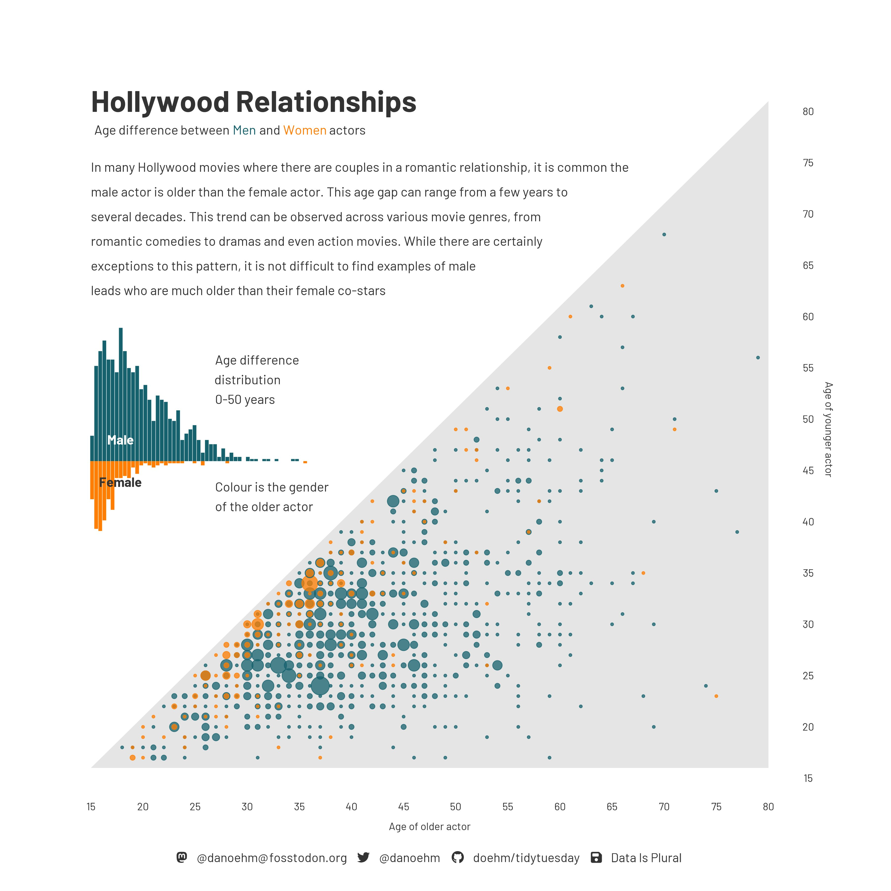

## While you wait: Participate 📱💻 {.small}

```{r}
#| include: false
library(tidyverse)
durham_climate <- read_csv("data/durham-climate.csv")
```

::: columns

::: {.column width="70%"}

::: wooclap

To keep some rows in a data frame and discard others, I use BLANK. To keep some columns and discard others, I use BLANK.

::: wooclap-choices
- group_by; arrange;
- filter; select;
- bye row; seeya column;
- a shovel; your bear hands;
- select; filter
:::

:::

:::

::: {.column width="30%"}

:::

:::

## On the horizon {.small}

Spring break is three weeks away. Here's what happens in the meantime:

::: incremental 
- Wed Feb 18: submit HW 4;
- Thu Feb 19: JZ posts Midterm 1 study-guide;
- Thu Feb 19: meet project teams and start proposal;
- Sun Feb 22: proposal due;
- Wed Feb 25: Midterm 1 in-class;
- Thu Feb 26: proposal feedback returned;
- Thu Feb 26: Midterm 1 take-home posted;
- Sun Mar 01: submit Midterm 1 take-home;
- Thu Mar 05: make some major project progress.
:::


. . .

After that, I forbid any of us from thinking about this class until March 16 *at the earliest*.

# Reading data into R

## Reading rectangular data

-   Using [**readr**](https://readr.tidyverse.org/):
    -   Most commonly: `read_csv()`
    -   Maybe also: `read_tsv()`, `read_delim()`, etc.

. . .

-   Using [**readxl**](https://readxl.tidyverse.org/): `read_excel()`

. . .

-   Using [**googlesheets4**](https://googlesheets4.tidyverse.org/): `read_sheet()` -- We haven't covered this in the videos, but might be useful for your projects

# Application exercise

## Reading and writing CSV files

-   Read a CSV file

-   Split it into subsets based on features of the data

-   Write out subsets as CSV files

## Age gap in Hollywood relationships {.smaller}

::: columns
::: {.column width="25%"}
::: question
What is the story in this visualization?
:::
:::

::: {.column width="75%"}
{fig-align="center" width="600"}


:::
:::


