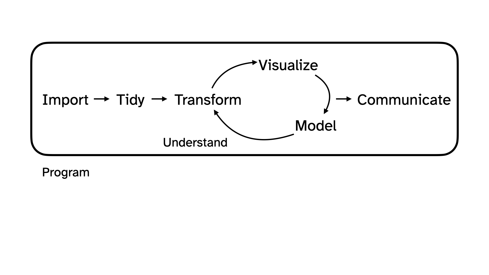
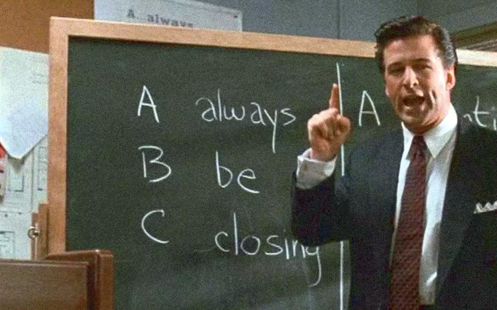

# That pesky midterm...

## Midterm Exam 1

```{r}
#| include: false

library(tidyverse)
```

Worth 20% of your final grade; consists of two parts:

-   **In-class**: worth 70% of the Midterm 1 grade;

    -   Thursday February 20 11:45 AM - 1:00 PM

-   **Take-home**: worth 30% of the Midterm 1 grade.

    -   Released Thursday February 20 at 1:00 PM;
    -   Due Monday February 24 at 8:30 AM.

## In-class

::: incremental
-   All multiple choice;

-   You will take it in Bio Sciences 111 (this room) or Physics 128;

-   You get both sides of one 8.5" x 11" note sheet that you and only you created (written, typed, iPad, etc);

-   If you do better on the final than you do on this, the final exam score will replace this.
:::

. . .

::: callout-important
If you have testing accommodations, make sure I get proper documentation from SDAO and make appointments in the Testing Center by Friday. The appointment should overlap substantially with our class time if possible.
:::

## Example in-class question

Which command will replace a pre-existing column in a data frame with a new and improved version of itself?

a.  `group_by`
b.  `summarize`
c.  `pivot_wider`
d.  `geom_replace`
e.  `mutate`

## Example in-class question

```{r}
#| echo: false

df <- tibble(
  x = c(1, 2, 3, 4, 5, 6),
  y = c("John", "John", "Cameron", "Zito", "Zito", "Zito")
)
```

::: columns
::: {.column width="50%"}
```{r}
df
```
:::

::: {.column width="50%"}
```{r}
#| eval: false 

df |>
  group_by(y) |>
  summarize(xbar = mean(x))
```

How many rows will this output have?

a.  1
b.  2
c.  3
d.  6
e.  11
:::
:::

## Example in-class question {.scrollable}

::: columns
::: {.column width="50%"}
Which box plot is visualizing the same data as the histogram?
:::

::: {.column width="50%"}
```{r}
#| echo: false
#| warning: false
set.seed(100)
x <- c(rnorm(150), rnorm(350, mean = 2, sd = 0.5))
df <- tibble(x = x)
ggplot(df, aes(x = x)) +
  geom_histogram() + 
  theme(axis.text = element_text(size = 36)) + 
  labs(x = NULL, y = NULL)
```
:::
:::

```{r}
#| echo: false
#| fig-asp: 0.33
#| warning: false
w <- rnorm(500)
y <- c(pmax(rnorm(350, mean = -1), -2), rnorm(150, mean = 2, sd = 0.5))
z <- x + 10
X <- as_tibble(cbind(sort(rep(1:4, 500)), c(w, z, x, y))) |>
  mutate(
    V1 = case_when(
      V1 == 1 ~ "a",
      V1 == 2 ~ "b",
      V1 == 3 ~ "c",
      V1 == 4 ~ "d",
    )
  )
ggplot(X, aes(x = V2)) + 
  geom_boxplot() + 
  facet_wrap(.~V1, scales = "free") + 
  theme(axis.text = element_text(size = 18), 
        axis.text.y = element_blank(),
        axis.ticks.y = element_blank()) + 
  labs(x = NULL, y = NULL)
```

## What should I put on my cheat sheet?

. . .

[**Ask one of our undergrad TAs!**](https://edstem.org/us/courses/70595/discussion/6137999) They took the class. I didn't.

::: incremental
-   description of common functions;
-   description of different visualizations: how to interpret, and what to use when;
-   doodles;
-   cute words of affirmation.
:::

. . .

::: callout-warning
Don't waste space on the details of any specific applications or datasets we've seen (penguins, Bechdel, gerrymandering, midwest, etc). Anything we want you to know about a particular application will be introduced from scratch within the exam.
:::

## Take-home

::: incremental
-   It will be just like a lab, only shorter;
-   Completely open-resource, but citation policies apply;
-   Absolutely no collaboration of any kind;
-   Seek help by posting *privately* on Ed;
-   Submit your final PDF to Gradescope in the usual way.
:::

## Reminder: conduct policies

::: incremental
-   Uncited use of outside resources or inappropriate collaboration will result in a zero and be referred to the conduct office;
-   If a conduct violation of any kind is discovered, your final letter grade in the course will be permanently reduced (A- down to B+, B+ down to B, etc);
-   If folks share solutions, all students involved will be penalized equally, the sharer the same as the recipient.
:::

. . .

::: callout-warning
## It's not personal.

These policies apply to everyone. I don't care who your parents are, or what medical schools you are applying to in the fall. Grow up and act right.
:::

## Things you can do to study

::: incremental
-   **Practice problems**: released Thursday February 13;
-   **Attend lab**: review game on Monday February 17;
-   **Old labs**: correct parts where you lost points;
-   **Old AEs**: complete tasks we didn't get to and compare with key;
-   **Code along**: watch these videos specifically;
-   **Textbook**: odd-numbered exercises in the back of Chs. 1, 4, 5, 6.
:::

# Let's zoom out for a sec...

## Data science and statistical thinking

Before Midterm 1...

-   **Data science**: the real-world *art* of transforming messy, imperfect, incomplete data into knowledge;

After Midterm 1...

-   **Statistics**: the mathematical discipline of quantifying our uncertainty about that knowledge.

## Data science {.medium}

{fig-align="center"}

## Data science {.medium}

::: incremental
1.  **Collection**: we won't seriously study this!

    -   **for us**: data importing (`read_csv`), and webscraping (next time);
    -   **but really**: domain-specific issues of measurement, survey design, experimental design, etc;
:::

## From last time: data collection

I sent out my lil' survey with Google Forms, downloaded the responses in a CSV, and read that sucker in:

::: columns
::: {.column width="35%"}
<iframe src="https://docs.google.com/forms/d/e/1FAIpQLSf0x7gOZY04c9vzdyIdm-v_vCqL0oFaQI9-LWB8Dt3uf3TriQ/viewform?embedded=true" width="350" height="400" frameborder="0" marginheight="0" marginwidth="0">

Loading…

</iframe>
:::

::: {.column width="65%"}
```{r}
survey <- read_csv("data/survey-2025-02-06.csv")
survey
```
:::
:::

## Data science {.medium}

1.  **Collection**: we won't seriously study this!

    -   **for us**: data importing (`read_csv`), and webscraping (next time);
    -   **but really**: domain-specific issues of measurement, survey design, experimental design, etc;

::: incremental
2.  **Preparation**: cleaning, wrangling, and otherwise *tidying* the data so we can actually work with it.

    -   **keywords**: `mutate`, `fct_relevel`, `pivot_*`, `*_join`
:::

## From last time: data preparation {.scrollable}

```{r}
survey <- survey |>
  rename(
    tue_classes = `How many classes do you have on Tuesdays?`,
    year = `What year are you?`
  ) |>
  mutate(
    tue_classes = case_when(
      tue_classes == "2 -3" ~ "3",
      tue_classes == "3 classes" ~ "3",
      tue_classes == "Four" ~ "4",
      tue_classes == "TWO MANY" ~ "2",
      tue_classes == "Three" ~ "3",
      tue_classes == "Two" ~ "2",
      tue_classes == "Two plus a chemistry lab" ~ "3",
      tue_classes == "three" ~ "3",
      .default = tue_classes
    ),
    tue_classes = as.numeric(tue_classes),
    year = fct_relevel(year, "First-year", "Sophomore", "Junior", "Senior")
  ) |>
  select(tue_classes, year)
survey
```

## Data science {.medium}

1.  **Collection**: we won't seriously study this!

    -   **for us**: data importing (`read_csv`), and webscraping (next time);
    -   **but really**: domain-specific issues of measurement, survey design, experimental design, etc;

2.  **Preparation**: cleaning, wrangling, and otherwise *tidying* the data so we can actually work with it.

    -   **keywords**: `mutate`, `fct_relevel`, `pivot_*`, `*_join`

::: incremental
3.  **Analysis**: finally transform the data into *knowledge*...

    -   **pictures**: `ggplot`, `geom_*`, etc
    -   **numerical summaries**: `summarize`, `group_by`, `count`, `mean`, `median`, `sd`, `quantile`, `IQR`, `cor`, etc
:::

## From last time: data analysis

A human being can learn nothing from staring at this box:

```{r}
survey
```

## From last time: data analysis

Picture!

```{r}
ggplot(survey, aes(x = tue_classes, fill = year)) + 
  geom_bar(position = "dodge")
```

## From last time: data analysis

Better picture?

```{r}
ggplot(survey, aes(x = tue_classes, fill = year)) + 
  geom_bar(position = "fill")
```

## From last time: data analysis

Numbers!

```{r}
survey |>
  count(tue_classes, year) |>
  group_by(tue_classes) |>
  mutate(prop = n / sum(n))
```

## Data science {.medium}

1.  **Collection**: we won't seriously study this!

    -   **for us**: data importing (`read_csv`), and webscraping (next time);
    -   **but really**: domain-specific issues of measurement, survey design, experimental design, etc;

2.  **Preparation**: cleaning, wrangling, and otherwise *tidying* the data so we can actually work with it.

    -   **keywords**: `mutate`, `fct_relevel`, `pivot_*`, `*_join`

3.  **Analysis**: finally transform the data into *knowledge*...

    -   **pictures**: `ggplot`, `geom_*`, etc
    -   **numerical summaries**: `summarize`, `group_by`, `count`, `mean`, `median`, `sd`, `quantile`, `iqr`, `cor`, etc

. . .

The pictures and the summaries need to work together!

## A cautionary tale: Anscombe's quartet

```{r}
#| echo: false
anscombe_tidy <- anscombe |>
    mutate(observation = seq_len(n())) |>
    gather(key, value, -observation) |>
    separate(key, c("variable", "set"), 1, convert = TRUE) |>
    mutate(set = c("I", "II", "III", "IV")[set]) |>
    spread(variable, value)
```

::: columns
::: {.column width="25%"}
Dataset I

```{r}
#| echo: false
anscombe_tidy |>
  filter(set == "I") |>
  select(x, y)
```
:::

::: {.column width="25%"}
Dataset II

```{r}
#| echo: false
anscombe_tidy |>
  filter(set == "II") |>
  select(x, y)
```
:::

::: {.column width="25%"}
Dataset III

```{r}
#| echo: false
anscombe_tidy |>
  filter(set == "III") |>
  select(x, y)
```
:::

::: {.column width="25%"}
Dataset IV

```{r}
#| echo: false
anscombe_tidy |>
  filter(set == "IV") |>
  select(x, y)
```
:::
:::

## A cautionary tale: Anscombe's quartet

```{r}
ggplot(anscombe_tidy, aes(x, y)) +
  geom_point() +
  facet_wrap(~ set) 
```

## A cautionary tale: Anscombe's quartet

```{r}
ggplot(anscombe_tidy, aes(x, y)) +
  geom_point() +
  facet_wrap(~ set) +
  geom_smooth(method = "lm", se = FALSE)
```

## If you only looked at summary statistics...

```{r}
anscombe_tidy |>
  group_by(set) |>
  summarize(
    xbar = mean(x),
    ybar = mean(y),
    sx = sd(x),
    sy = sd(y),
    r = cor(x, y)
  )
```

## Our motto: ABV! {.large}

. . .

No, not alcohol by volume...

::: columns
::: {.column width="20%"}
::: incremental
-   `A`lways!
-   `B`e!
-   `V`isualizing!
:::
:::

::: {.column .fragment width="70%"}
{fig-align="right" width="80%"}
:::
:::

