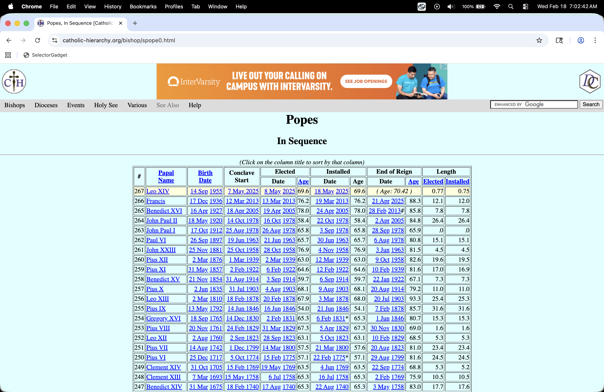
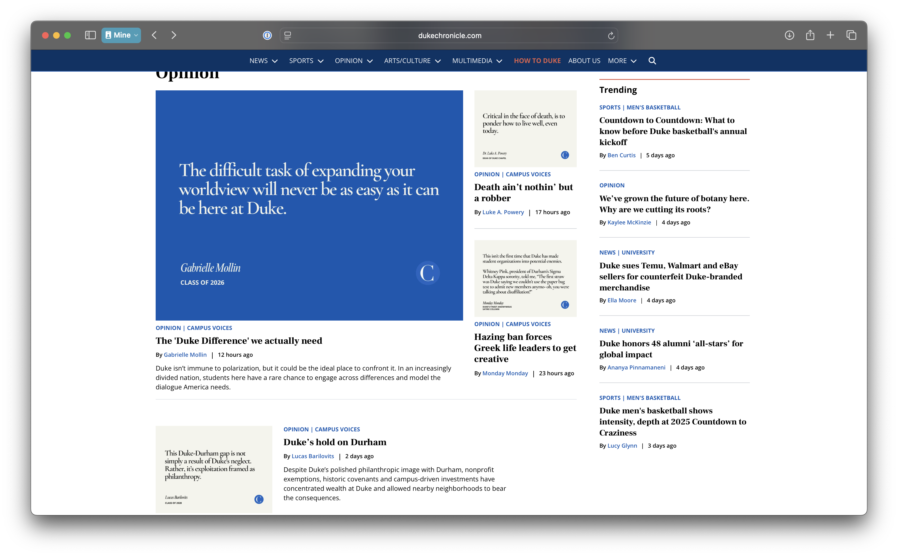
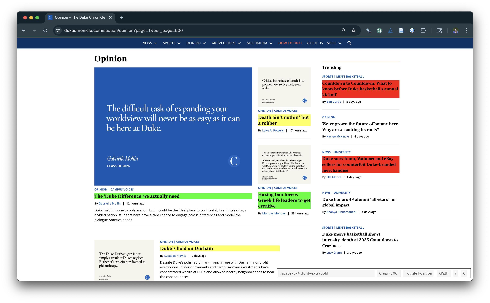
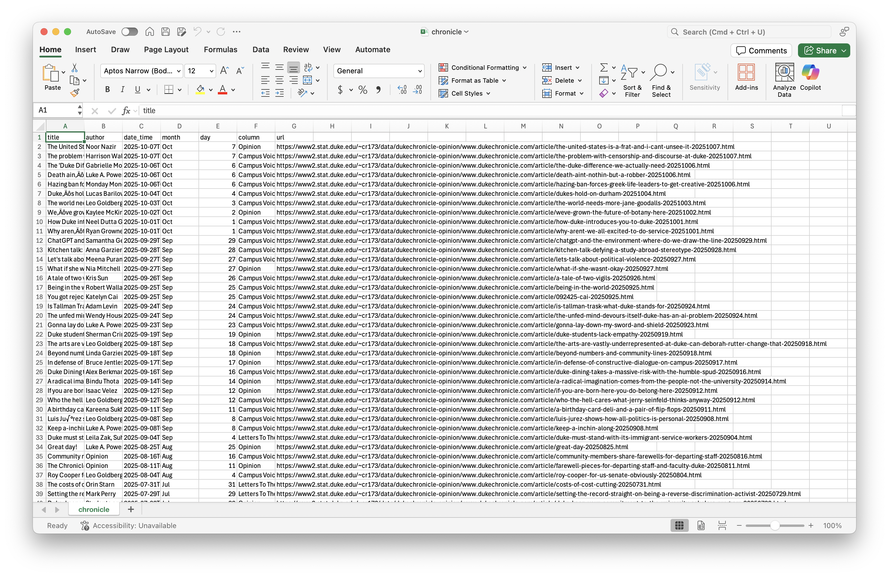

```{r}
#| label: setup
#| include: false
library(tidyverse)
library(rvest)
ggplot2::theme_set(ggplot2::theme_gray(base_size = 24))
todays_ae <- "ae-11-chronicle-scrape"
```

## While you wait: Participate 📱💻 

::: columns

::: {.column width="70%"}

::: wooclap

How old were you on February 11 2013?

:::

:::

::: {.column width="30%"}

:::

:::


::: callout-important
## For today!

Download Chrome web browser if you don't have it already, and add the [SelectorGadget](https://selectorgadget.com) to the bookmarks bar.

:::

# Story time

## Time-to-event data

Measuring how long it takes for something to happen:

::: incremental 
- How long until the patient recovers from surgery?
- How long until the patient dies?
- How long until the lightbulb burns out?
- How long until laptop battery dies?
- How long after infection until symptoms kick in?
- How long until next call in call center?
- How long until you find your next job?
- How long until volcano erupts again?
:::


## A brief history of time {.small}

::: incremental
- Feb 11 2013: Pope Benedict announces resignation;
    - JZ is a freshman in college;
- Feb 28 2013: Pope Benedict resigns;
- Mar 12 2013: Conclave begins;
- Mar 13 2013: Jorge Bergolio (Pope Francis) elected;
- Summer 2015: JZ's summer internship involves a ton of web scraping;
    - He then forgets it all for ten years;
- Apr 21 2025: Pope Francis dies;
- May 05 2025: JZ submits last spring's final grades;
- May 07 2025: Conclave begins;
- May 08 2025: Robert Prevost (Pope Leo XIV) elected;
    - JZ momentarily emerges from his end-of-semester stupor with a question.
:::

## How long do conclaves usually last? {.medium}

. . .

<https://catholic-hierarchy.org/bishop/spope0.html>

. . .

{fig-align="center" width="70%"}

. . .

How do I...get this?

## Reality check {.medium}

Because the data are already formatted as an honest-to-goodness table, you *can* successfully highlight the whole table with your cursor, copy it, paste it into an empty Excel spreadsheet, and then clean it by hand. 

BUT:

- That's tedious;
- It's not reproducible;
- The work you put in is not reusable;
- This method will not generalize to harder tasks like you will see in the AE.

# Web scraping

## Scraping the web: what? why? {.smaller}

-   Increasing amount of data is available on the web

-   These data are provided in an unstructured format: you can always copy&paste, but it's time-consuming and prone to errors

-   Web scraping is the process of extracting this information automatically and transform it into a structured dataset

-   Two different scenarios:

    -   Screen scraping: extract data from source code of website, with html parser (easy) or regular expression matching (less easy).

    -   Web APIs (application programming interface): website offers a set of structured http requests that return JSON or XML files.

## Hypertext Markup Language {.smaller}

Most of the data on the web is still largely available as HTML - while it is structured (hierarchical) it often is not available in a form useful for analysis (flat / tidy).

::: small
``` html
<html>
  <head>
    <title>This is a title</title>
  </head>
  <body>
    <p align="center">Hello world!</p>
    <br/>
    <div class="name" id="first">John</div>
    <div class="name" id="last">Doe</div>
    <div class="contact">
      <div class="home">555-555-1234</div>
      <div class="home">555-555-2345</div>
      <div class="work">555-555-9999</div>
      <div class="fax">555-555-8888</div>
    </div>
  </body>
</html>
```
:::

## rvest {.smaller}

::::: columns
::: {.column width="50%"}
-   The **rvest** package makes basic processing and manipulation of HTML data straight forward
-   It's designed to work with pipelines built with `|>`
-   [rvest.tidyverse.org](https://rvest.tidyverse.org)

```{r}
#| message: false
library(rvest)
```

:::

::: {.column width="50%"}
[{fig-alt="rvest hex logo" fig-align="right" width="400"}](https://rvest.tidyverse.org/)
:::
:::::

## rvest {.smaller}

Core functions:

-   `read_html()` - read HTML data from a url or character string.

-   `html_elements()` - select specified elements from the HTML document using CSS selectors (or xpath).

-   `html_element()` - select a single element from the HTML document using CSS selectors (or xpath).

-   `html_table()` - parse an HTML table into a data frame.

-   `html_text()` / `html_text2()` - extract tag's text content.

-   `html_name` - extract a tag/element's name(s).

-   `html_attrs` - extract all attributes.

-   `html_attr` - extract attribute value(s) by name.

## html, rvest, & xml2 {.smaller}

```{r}
html <-
  '<html>
  <head>
    <title>This is a title</title>
  </head>
  <body>
    <p align="center">Hello world!</p>
    <br/>
    <div class="name" id="first">John</div>
    <div class="name" id="last">Doe</div>
    <div class="contact">
      <div class="home">555-555-1234</div>
      <div class="home">555-555-2345</div>
      <div class="work">555-555-9999</div>
      <div class="fax">555-555-8888</div>
    </div>
  </body>
</html>'
```

. . .

```{r}
read_html(html)
```

## Selecting elements {.smaller}

```{r}
read_html(html) |> html_elements("p")
```

. . .

```{r}
read_html(html) |> html_elements("p") |> html_text()
```

. . .

```{r}
read_html(html) |> html_elements("p") |> html_name()
```

. . .

```{r}
read_html(html) |> html_elements("p") |> html_attrs()
```

. . .

```{r}
read_html(html) |> html_elements("p") |> html_attr("align")
```

## More selecting tags {.smaller}

::: medium

```{r}
read_html(html) |> html_elements("div")
```

:::

. . .

::: medium

```{r}
read_html(html) |> html_elements("div") |> html_text()
```

:::

## CSS selectors {.smaller}

-   We will use a tool called SelectorGadget to help us identify the HTML elements of interest by constructing a CSS selector which can be used to subset the HTML document.

. . .

-   Some examples of basic selector syntax is below,

::: small
| Selector | Example | Description |
|:-----------------|:-----------------|:-----------------------------------|
| .class | `.title` | Select all elements with class="title" |
| #id | `#name` | Select all elements with id="name" |
| element | `p` | Select all \<p\> elements |
| element element | `div p` | Select all \<p\> elements inside a \<div\> element |
| element\>element | `div > p` | Select all \<p\> elements with \<div\> as a parent |
| \[attribute\] | `[class]` | Select all elements with a class attribute |
| \[attribute=value\] | `[class=title]` | Select all elements with class="title" |
:::

## CSS classes and ids

```{r}
read_html(html) |> html_elements(".name")
```

. . .

```{r}
read_html(html) |> html_elements("div.name")
```

. . .

```{r}
read_html(html) |> html_elements("#first")
```

## Text with `html_text()` vs. `html_text2()` {.smaller}

```{r}
html = read_html(
  "<p>  
    This is the first sentence in the paragraph.
    This is the second sentence that should be on the same line as the first sentence.<br>This third sentence should start on a new line.
  </p>"
)
```

. . .

```{r}
html |> html_text()
html |> html_text2()
```

## HTML tables with `html_table()` {.smaller}

```{r}
html_table =
  '<html>
  <head>
    <title>This is a title</title>
  </head>
  <body>
    <table>
      <tr> <th>a</th> <th>b</th> <th>c</th> </tr>
      <tr> <td>1</td> <td>2</td> <td>3</td> </tr>
      <tr> <td>2</td> <td>3</td> <td>4</td> </tr>
      <tr> <td>3</td> <td>4</td> <td>5</td> </tr>
    </table>
  </body>
</html>'
```

. . .

```{r}
read_html(html_table) |>
  html_elements("table") |>
  html_table()
```

# Back to my lil' project

## Pull down the webpage {.small .scrollable}

This is the easy part!

```{r}
url <- "https://catholic-hierarchy.org/bishop/spope0.html"
page <- read_html(url)

page
```

## Parse the table element {.small .scrollable}

Already pretty good!

```{r}
popes_table <- page |>
  html_element("table") |>
  html_table(fill = TRUE)

glimpse(popes_table)
```

## Let's clean the colum name {.small .scrollable}

```{r}
names(popes_table) <- make.unique(names(popes_table))

popes_clean <- popes_table |>
  rename(
    papal_number = `#`,
    papal_name = `PapalName`,
    birth_date = `BirthDate`,
    conclave_start = `ConclaveStart`,
    date_elected = `Elected`,
    age_elected = `Elected.1`,
    date_installed = `Installed`,
    age_installed = `Installed.1`,
    date_end = `End of Reign`, 
    age_end = `End of Reign.1`,
    years_elected = `Length`,
    years_installed = `Length.1`,
  )

glimpse(popes_clean)
```

## Discard that funky row at the top {.small .scrollable}

```{r}
popes_clean <- popes_clean |>
  filter(papal_name != "PapalName")

glimpse(popes_clean)
```

## Sort out the variable types {.small .scrollable}

```{r}
popes_clean <- popes_clean |>
  mutate(
    papal_number = as.integer(papal_number),
    age_elected = as.numeric(age_elected),
    age_installed = as.numeric(age_installed),
    age_end = as.numeric(age_end),
    years_elected = as.numeric(years_elected),
    years_installed = as.numeric(years_installed),
    conclave_start = as.Date(conclave_start, format = "%d %b %Y"),
    date_elected = as.Date(date_elected, format = "%d %b %Y"),
    birth_date = as.Date(birth_date, format = "%d %b %Y"),
    date_end = ifelse(papal_name == "Leo XIV", NA, date_end),
    resigned = str_detect(date_end, "#"),
    date_end = str_remove_all(date_end, "#"),
    date_end = as.Date(date_end, format = "%d %b %Y"),
    not_bishop = str_detect(date_installed, "\\*"),
    date_installed = str_remove_all(date_installed, "\\*"),
    date_installed = as.Date(date_installed, format = "%d %b %Y")
  )

glimpse(popes_clean)
```

## Add new variable {.small .scrollable}

Let's measure the length of each conclave in days:

```{r}
popes_clean <- popes_clean |>
  mutate(
    conclave_length_days = as.integer(date_elected - conclave_start)
  ) |>
  relocate(conclave_length_days)

glimpse(popes_clean)
```

## Answer the question! {.small .scrollable}

::: columns

::: {.column width="50%"}

```{r}
ggplot(popes_clean, aes(x = conclave_length_days)) + 
  geom_histogram() + 
  labs(
    x = "Days",
    title = "Length of papal conclaves",
    caption = "Source: scraped from catholic-hierarchy.org"
  )
```

:::

::: {.column width="50%"}
```{r}
popes_clean |>
  summarize(
    mean_length = mean(conclave_length_days, na.rm = T),
    median_length = median(conclave_length_days, na.rm = T),
    sd_length = sd(conclave_length_days, na.rm = T)
  )
```

```{r}
popes_clean |>
  filter(!is.na(conclave_length_days)) |>
  count(conclave_length_days) |>
  mutate(prop = n / sum(n))
```
:::

:::

# Application exercise

## Participate 📱💻 

::: columns

::: {.column width="70%"}

::: wooclap

How often do you read The Chronicle?

::: wooclap-options
-   Every day
-   3-5 times a week
-   Once a week
-   Rarely
-   Never
:::

:::

:::

::: {.column width="30%"}

:::

:::

## Reading The Chronicle

::: question
What do you think is the most common word in the titles of The Chronicle opinion pieces?
:::

## Analyzing The Chronicle

```{r}
#| label: load-chronicle-data
#| include: false
library(tidyverse)
chronicle <- read_csv("data/chronicle.csv")
```

```{r}
#| label: chronicle-common-words
#| echo: false
#| message: false
stop_words <- read_csv("data/stop-words.csv")
chronicle |>
  tidytext::unnest_tokens(word, title) |>
  mutate(word = str_replace_all(word, "’", "'")) |>
  anti_join(stop_words) |>
  count(word, sort = TRUE) |>
  filter(word != "duke's") |>
  slice_head(n = 20) |>
  mutate(word = fct_reorder(word, n)) |>
  ggplot(aes(y = word, x = n, fill = log(n))) +
  geom_col(show.legend = FALSE) +
  theme_minimal(base_size = 16) +
  labs(
    x = "Number of mentions",
    y = "Word",
    title = "The Chronicle - Opinion pieces",
    subtitle = "Common words in the 500 most recent opinion piece titles",
    caption = "Source: Data scraped from The Chronicle on Oct 6, 2025"
  ) +
  theme(
    plot.title.position = "plot",
    plot.caption = element_text(color = "gray30")
  )
```

## Reading The Chronicle

::: question
How do you think the sentiments in opinion pieces in The Chronicle compare across authors?
Roughly the same?
Wildly different?
Somewhere in between?
:::

## Analyzing The Chronicle

```{r}
#| label: chronicle-sentiments
#| echo: false
#| message: false
#| fig-asp: 0.75
#| fig-width: 7
#| fig-align: center
afinn_sentiments <- read_csv("data/afinn-sentiments.csv")
chronicle |>
  tidytext::unnest_tokens(word, title, drop = FALSE) |>
  mutate(word = str_replace_all(word, "’", "'")) |>
  anti_join(stop_words) |>
  left_join(afinn_sentiments) |>
  group_by(author, title) |>
  summarize(total_sentiment = sum(value, na.rm = TRUE), .groups = "drop") |>
  group_by(author) |>
  summarize(
    n_articles = n(),
    avg_sentiment = mean(total_sentiment, na.rm = TRUE),
  ) |>
  filter(n_articles > 2 & !is.na(author)) |>
  arrange(desc(avg_sentiment)) |>
  slice(c(1:10, 30:39)) |>
  mutate(
    author = fct_reorder(author, avg_sentiment),
    neg_pos = if_else(avg_sentiment < 0, "neg", "pos"),
    label_position = if_else(neg_pos == "neg", 0.25, -0.25)
  ) |>
  ggplot(aes(y = author, x = avg_sentiment)) +
  geom_col(aes(fill = neg_pos), show.legend = FALSE) +
  geom_text(
    aes(x = label_position, label = author, color = neg_pos),
    hjust = c(rep(1, 10), rep(0, 10)),
    show.legend = FALSE,
    fontface = "bold"
  ) +
  geom_text(
    aes(label = round(avg_sentiment, 1)),
    hjust = c(rep(1.25, 10), rep(-0.25, 10)),
    color = "white",
    fontface = "bold"
  ) +
  scale_fill_manual(values = c("neg" = "#4d4009", "pos" = "#FF4B91")) +
  scale_color_manual(values = c("neg" = "#4d4009", "pos" = "#FF4B91")) +
  coord_cartesian(xlim = c(-2, 2)) +
  labs(
    x = "negative  ←     Average sentiment score (AFINN)     →  positive",
    y = NULL,
    title = "The Chronicle - Opinion pieces\nAverage sentiment scores of titles by author",
    subtitle = "Top 10 average positive and negative scores",
    caption = "Source: Data scraped from The Chronicle on Sep 30, 2024"
  ) +
  theme_void(base_size = 16) +
  theme(
    plot.title = element_text(hjust = 0.5),
    plot.subtitle = element_text(
      hjust = 0.5,
      margin = unit(c(0.5, 0, 1, 0), "lines")
    ),
    axis.title.x = element_text(color = "gray30", size = 12),
    plot.caption = element_text(color = "gray30", size = 10)
  )
```

## All of this analysis is done in R! {.centered}

::: hand
(mostly) with tools you already know!
:::

## Common words in The Chronicle titles {.smaller}

Code for the earlier plot:

```{r}
#| ref.label: chronicle-common-words
#| fig-show: hide
#| message: false
#| code-line-numbers: "|2-3|5|6|8|9|10-23"
```

## Avg sentiment scores of titles {.smaller}

Code for the earlier plot:

```{r}
#| ref.label: chronicle-sentiments
#| fig-show: hide
#| message: false
#| code-line-numbers: "|2-3|5|6|7-8|9-13|22-55"
```

## Where is the data coming from? {.smaller}

::: center
<https://www.dukechronicle.com/section/opinion>
:::

[{fig-align="center" width="800"}](https://www.dukechronicle.com/section/opinion?page=1&per_page=500)

## Where is the data coming from? {.smaller}


```{r}
chronicle
```


## SelectorGadget

**SelectorGadget** ([selectorgadget.com](http://selectorgadget.com)) is a javascript based tool that helps you interactively build an appropriate CSS selector for the content you are interested in.

{fig-align="center" width="1000"}

## Opinion articles in The Chronicle

Go to <https://www.dukechronicle.com/section/opinion?page=1&per_page=500>.

::: question
How many articles are on the page?
:::

## Goal

::::: columns
::: {.column width="50%"}
-   Scrape data and organize it in a tidy format in R
-   Perform light text parsing to clean data
-   Summarize and visualze the data
:::

::: {.column width="50%"}
{fig-align="center"}
:::
:::::

## A new R workflow {.smaller}

-   When working in a Quarto document, your analysis is re-run each time you knit

-   If web scraping in a Quarto document, you'd be re-scraping the data each time you knit, which is undesirable (and not *nice*)!

-   An alternative workflow:

    -   Use an R script to save your code
    -   Saving interim data scraped using the code in the script as CSV or RDS files
    -   Use the saved data in your analysis in your Quarto document

## `{r} todays_ae` {.smaller}

::: appex
-   Go to your ae project in RStudio.

-   If you haven't yet done so, make sure all of your changes up to this point are committed and pushed, i.e., there's nothing left in your Git pane.

-   If you haven't yet done so, click Pull to get today's application exercise file: *`{r} paste0(todays_ae, ".qmd")`* and *`chronicle-scrape.R`*.
:::
