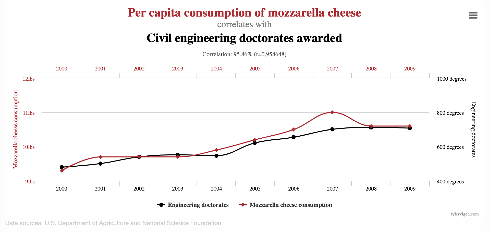
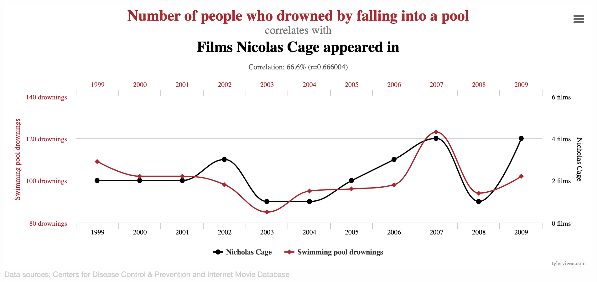

```{r}
#| include: false
library(tidyverse)
library(tidymodels)
library(fivethirtyeight)
movie_scores <- fandango |>
  rename(
    critics = rottentomatoes, 
    audience = rottentomatoes_user
  )
todays_ae <- "ae-16-modeling-penguins"
```

## While you wait: Participate 📱💻 {.xsmall}

:::::: columns
:::: {.column width="70%"}
::: wooclap
Play the game a few times and report your score: smallest absolute difference between your guess and the actual correlation, e.g., if the actual correlation was 0.8 and you guessed 0.6, your score would be 0.2. If the actual correlation was -0.4 and you guessed 0.1, your score would be 0.5. 

- Option 1 - Calculates your score for you: <https://duke.is/corr-game-1>

- Option 2 - You need to calculate your own score: <https://duke.is/corr-game-2>

:::
::::

::: {.column width="30%"}

:::
::::::

# Correlation vs. causation

## Spurious correlations

{fig-align="center"}

::: aside
Source: [tylervigen.com/spurious-correlations](https://www.tylervigen.com/spurious-correlations)
:::

## Spurious correlations

{fig-align="center"}

::: aside
Source: [tylervigen.com/spurious-correlations](https://www.tylervigen.com/spurious-correlations)
:::

# Linear regression with a single predictor

## Data prep

-   Rename Rotten Tomatoes columns as `critics` and `audience`
-   Rename the dataset as `movie_scores`

```{r data-prep}
#| echo: true

movie_scores <- fandango |>
  rename(
    critics = rottentomatoes, 
    audience = rottentomatoes_user
  )
```

## Data overview

```{r data-overview}
#| echo: true
movie_scores |>
  select(critics, audience)
```

## Data visualization {.small}

```{r}
#| echo: false
#| fig-height: 4.5
ggplot(movie_scores, aes(x = critics, y = audience)) +
  geom_point(alpha = 0.5) + 
  labs(
    x = "Critics Score" , 
    y = "Audience Score"
  )
```


## Data visualization: linear model {.small}

```{r}
#| echo: false
#| message: false
#| fig-height: 4.5
ggplot(movie_scores, aes(x = critics, y = audience)) +
  geom_smooth(method = "lm", se = FALSE) +
  geom_point(alpha = 0.5) + 
  labs(
    x = "Critics Score" , 
    y = "Audience Score"
  )
```

::: columns
::: {.column width="60%"}
```{r}
#| echo: false
#| message: false

tidy(lm(audience ~ critics, data = movie_scores))
```
:::

::: {.column width="40%"}
:::
:::

## Data visualization: linear model {.small}

```{r}
#| echo: false
#| message: false
#| fig-height: 4.5
ggplot(movie_scores, aes(x = critics, y = audience)) +
  geom_smooth(method = "lm", se = FALSE) +
  geom_point(alpha = 0.5) + 
  labs(
    x = "Critics Score" , 
    y = "Audience Score"
  )# +
  #stat_ellipse(geom = "polygon", color = "#FE5D26", fill = "#FE5D2630", type = "norm")
```

::: columns
::: {.column width="60%"}
```{r}
#| echo: false
#| message: false

tidy(lm(audience ~ critics, data = movie_scores))
```
:::

::: {.column width="40%"}
```{r}
#| message: false
#| echo: false

movie_scores |>
  summarize(r = cor(audience, critics))

```
:::
:::

## Prediction {.small}

::: columns
::: {.column width="60%"}
```{r}
#| echo: false

audience_critic_fit <- linear_reg() |> fit(audience ~ critics, data = movie_scores)

new_movies <- tibble(
  critics = c(20, 37.5, 88)
)

preds <- predict(audience_critic_fit, new_data = new_movies)

ggplot(movie_scores, aes(x = critics, y = audience)) +
  geom_smooth(method = "lm", se = FALSE) +
  geom_point(alpha = 0.5) + 
  labs(
    x = "Critics Score" , 
    y = "Audience Score"
  )  +
  annotate(
    "segment",
    x = new_movies$critics[1], xend = new_movies$critics[1], y = -Inf, yend = preds$.pred[1],
    color = "#FE5D26"
  ) +
  annotate(
    "segment",
    x = -Inf, xend = new_movies$critics[1], y = preds$.pred[1], yend = preds$.pred[1],
    color = "#FE5D26"
  )  +
  annotate(
    "segment",
    x = new_movies$critics[2], xend = new_movies$critics[2], y = -Inf, yend = preds$.pred[2],
    color = "#FE5D26"
  ) +
  annotate(
    "segment",
    x = -Inf, xend = new_movies$critics[2], y = preds$.pred[2], yend = preds$.pred[2],
    color = "#FE5D26"
  )  +
  annotate(
    "segment",
    x = new_movies$critics[3], xend = new_movies$critics[3], y = -Inf, yend = preds$.pred[3],
    color = "#FE5D26"
  ) +
  annotate(
    "segment",
    x = -Inf, xend = new_movies$critics[3], y = preds$.pred[3], yend = preds$.pred[3],
    color = "#FE5D26"
  )
```
:::

::: {.column width="40%"}

```{r}
#| message: false
#| echo: false

audience_critic_fit <- linear_reg() |> fit(audience ~ critics, data = movie_scores)

```

```{r}

new_movies <- tibble(
  critics = c(20, 37.5, 88)
)

predict(audience_critic_fit, 
        new_data = new_movies)
```

:::

:::

# Simple Linear Regression: How R Did It

## Regression model {#regression-model-1}

A **regression model** is a function that describes the relationship between the outcome, $Y$, and the predictor, $X$.

$$
\begin{aligned} Y &= \color{black}{\textbf{Model}} + \text{Error} \\[8pt]
&= \color{black}{\mathbf{f(X)}} + \epsilon \\[8pt]
&= \color{black}{\boldsymbol{\mu_{Y|X}}} + \epsilon \end{aligned}
$$

## Regression model

::: columns
::: {.column width="30%"}
$$
\begin{aligned} Y &= \color{#325b74}{\textbf{Model}} + \text{Error} \\[8pt]
&= \color{#325b74}{\mathbf{f(X)}} + \epsilon \\[8pt]
&= \color{#325b74}{\boldsymbol{\mu_{Y|X}}} + \epsilon 
\end{aligned}
$$
:::

::: {.column width="70%"}
```{r}
#| echo: false
#| message: false

m <- lm(audience ~ critics, data = movie_scores)
ggplot(data = movie_scores, 
       mapping = aes(x = critics, y = audience)) +
  geom_point(alpha = 0.5) + 
  geom_smooth(method = "lm", color = "#325b74", se = FALSE, linewidth = 1.5) +
  labs(x = "X", y = "Y") +
  theme_minimal() +
  theme(
    axis.text = element_blank(),
    axis.ticks.x = element_blank(), 
    axis.ticks.y = element_blank()
    )
```
:::
:::

## Simple linear regression {.smaller}

Use **simple linear regression** to model the relationship between a quantitative outcome ($Y$) and a single quantitative predictor ($X$): $$\Large{Y = \beta_0 + \beta_1 X + \epsilon}$$

::: incremental
-   $\beta_1$: True slope of the relationship between $X$ and $Y$
-   $\beta_0$: True intercept of the relationship between $X$ and $Y$
-   $\epsilon$: Error (residual)
:::

## Simple linear regression

$$\Large{\hat{Y} = b_0 + b_1 X}$$

-   $b_1$: Estimated slope of the relationship between $X$ and $Y$
-   $b_0$: Estimated intercept of the relationship between $X$ and $Y$
-   No error term!

## Choosing values for $b_1$ and $b_0$

```{r}
#| echo: false
#| message: false
ggplot(movie_scores, aes(x = critics, y = audience)) +
  geom_point(alpha = 0.4) + 
  geom_abline(intercept = 32.3155, slope = 0.5187, color = "#325b74", linewidth = 1.5) +
  geom_abline(intercept = 25, slope = 0.7, color = "gray") +
  geom_abline(intercept = 21, slope = 0.9, color = "gray") +
  geom_abline(intercept = 35, slope = 0.3, color = "gray") +
  labs(x = "Critics Score", y = "Audience Score")
```

## Residuals

```{r}
#| message: false
#| echo: false
#| fig-align: center
ggplot(movie_scores, aes(x = critics, y = audience)) +
  geom_point(alpha = 0.5) +
  geom_smooth(method = "lm", color = "#325b74", se = FALSE, linewidth = 1.5) +
  geom_segment(aes(x = critics, xend = critics, y = audience, yend = predict(m)), color = "steel blue") +
  labs(x = "Critics Score", y = "Audience Score") +
  theme(legend.position = "none")
```

$$\text{residual} = \text{observed} - \text{predicted} = y - \hat{y}$$

## Notation 

::: incremental
-   We have $n$ observations (generally, the number of rows in a df)

-   $i^{th}$ observation ($i$ from $1$ to $N$):

    -   $y_i$ : $i^{th}$ outcome

    -   $x_i$ : $i^{th}$ explanatory variable

    -   $\hat{y}$ : $i^{th}$ predicted outcome

    -   $e$ : $i^{th}$ residual
:::

## Least squares line {.smaller}

-   The residual for the $i^{th}$ observation is

$$e_i = \text{observed} - \text{predicted} = y_i - \hat{y}_i$$

-   The **sum of squared** residuals is

$$e^2_1 + e^2_2 + \dots + e^2_n$$

-   The **least squares line** is the one that **minimizes the sum of squared residuals**

## Least squares line {.scrollable}

```{r}
movies_fit <- linear_reg() |>
  fit(audience ~ critics, data = movie_scores)

tidy(movies_fit)
```

# Slope and intercept


## Participate 📱💻 {.xsmall}

:::::: columns
:::: {.column width="70%"}

::: wooclap
The slope of the model for predicting audience score from critics score is 0.519.
Which of the following is the best interpretation of this value?

$$\widehat{\text{audience}} = 32.3 + 0.519 \times \text{critics}$$

::: wooclap-choices
- For every one point increase in the critics score, the audience score goes up by 0.519 points, on average.
- For every one point increase in the critics score, we expect the audience score to be higher by 0.519 points, on average.
- For every one point increase in the critics score, the audience score goes up by 0.519 points.
- For every one point increase in the audience score, the critics score goes up by 0.519 points, on average.
:::

:::
::::

::: {.column width="30%"}

:::
::::::

## Participate 📱💻 {.xsmall}

:::::: columns
:::: {.column width="70%"}

::: wooclap
The intercept of the model for predicting audience score from critics score is 32.3.
Which of the following is the best interpretation of this value?

$$\widehat{\text{audience}} = 32.3 + 0.519 \times \text{critics}$$

::: wooclap-choices
- For movies with a critics score of 0 points, we expect the audience score to be 32.3 points, on average.
- For movies with an audience score of 0 points, we expect the critics score to be 32.3 points, on average.
- For every one point increase in the critics score, the audience score goes up by 32.3 points.
- For movies with an audience score of 0 points, we expect the critics score to be 0.519 points, on average.
:::

:::
::::

::: {.column width="30%"}

:::
::::::


## Is the intercept meaningful? {.medium}

✅ The intercept is meaningful in context of the data if

-   the predictor can feasibly take values equal to or near zero or
-   the predictor has values near zero in the observed data

. . .

🛑 Otherwise, it might not be meaningful!

. . .

From last time...

- It doesn't make sense to predict the mpg of a car that weighs 0 pounds;
- It *does* make sense to predict the ice duration of a lake at 0 degree temp.

## Properties of least squares regression

::: incremental
-   The regression line goes through the center of mass point (the coordinates corresponding to average $X$ and average $Y$): $b_0 = \bar{Y} - b_1~\bar{X}$

-   Slope has the same sign as the correlation coefficient: $b_1 = r \frac{s_Y}{s_X}$

-   Sum of the residuals is zero: $\sum_{i = 1}^n \epsilon_i = 0$

-   Residuals and $X$ values are uncorrelated
:::

# Application exercise

## `{r} todays_ae` {.smaller}

::: appex
-   Go to your ae project in RStudio.

-   If you haven't yet done so, make sure all of your changes up to this point are committed and pushed, i.e., there's nothing left in your Git pane.

-   If you haven't yet done so, click Pull to get today's application exercise file: *`{r} paste0(todays_ae, ".qmd")`*.

-   Work through the application exercise in class, and render, commit, and push your edits.
:::
