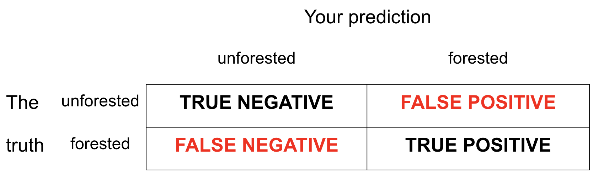
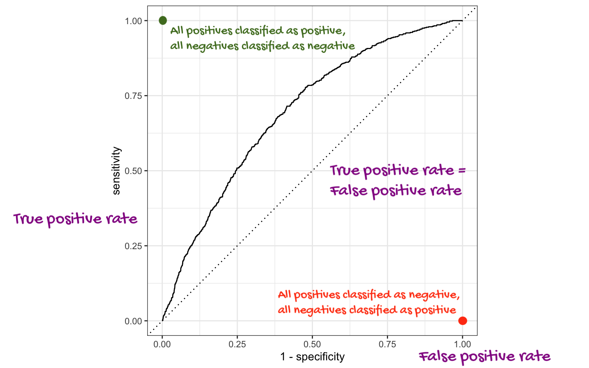

## While you wait: Participate 📱💻 {.small}

```{r}
#| label: load-packages
#| message: false
#| echo: false
library(tidyverse)
library(tidymodels)
library(openintro)
library(forested)
email <- openintro::email
todays_ae <- "ae-21-chicago-taxi-classification"

```

:::::: columns
:::: {.column width="70%"}
::: wooclap

Consider a fitted logistic regression:

$$
\log\left(\frac{\hat{p}}{1-\hat{p}}\right)=b_0+b_1x.
$$

Which of the following is a correct description of how the predictions of a logistic regression model change when the predictor changes from $x$ to $x+1$?

::: wooclap-choices
- $\hat{p}^{(new)} = \hat{p}^{(old)}\times e^{b_1}$
- $\hat{y}^{(new)} = \hat{y}^{(old)} + b_1$
- $\widehat{log~odds}^{(new)} = \widehat{log~odds}^{(old)}\times e^{b_1}$
- $\widehat{odds}^{(new)} = \widehat{odds}^{(old)}\times e^{b_1}$
- $\hat{y}^{(new)} = \hat{y}^{(old)} \times b_1$
:::

:::
::::

::: {.column width="30%"}

:::
::::::

# JZ plans your weekend for you

## Wednesday: SSMU Talk

:::::: columns
:::: {.column width="45%"}

::::

::: {.column width="55%"}

- The old broads in the stats mafia host an even older broad from the tidy mafia to scare you about your future
- Wednesday April 8 @ 4:30 pm
- Old Chem 116

:::
::::::

## Wednesday: Duke Symphony Concert

:::::: columns
:::: {.column width="40%"}

::::

::: {.column width="60%"}

- [Duke Symphony Orchestra](https://music.duke.edu/events/duke-symphony-orchestra-senior-night-2)
- Wednesday April 8 @ 7:30 pm
- Baldwin Auditorium (East Campus)
- WANANA classmates and TAs!

:::
::::::

## Thursday: Six Characters in Search of an Author

:::::: columns
:::: {.column width="40%"}

::::

::: {.column width="60%"}


- [Play by Luigi Pirandello](https://theaterstudies.duke.edu/six-characters-search-author-luigi-pirandello-adapted-neal-bell)
- April 9 - 11 @ 8 p.m 
- April 12 @ 2pm
- Sheafer Lab Theater here in Bryan Center
:::
::::::

## Friday: Duke Chinese Dance

:::::: columns
:::: {.column width="45%"}

::::

::: {.column width="55%"}

- Insta: [@dukechinesedance](https://www.instagram.com/dukechinesedance/)
- Friday April 10 @ 7pm
- Page Auditorium
- Classmates! TAs! Josh!

:::
::::::

## Saturday: DBBH's Spring Business Conference

:::::: columns
:::: {.column width="45%"}

::::

::: {.column width="55%"}

- Duke Business Behind Health (DBBH)
- Saturday April 11
- In the business school
- Great if you're pre-med, pre-biotech, etc
- Rub elbows with the muckety-mucks!
:::
::::::

## Saturday: Devils en Pointe *and* Embodiment

:::::: columns
:::: {.column width="40%"}

::::

::: {.column width="60%"}

- Devils en Pointe
- Embodiment
- Saturday April 11 @ 7pm
- Reynolds Industries Theater
- Classmates! More Shelly Han!

:::
::::::

## Sunday: Ishq Showcase

:::::: columns
:::: {.column width="45%"}

::::

::: {.column width="55%"}

- Insta: [@duke.ishq](https://www.instagram.com/duke.ishq/)
- Sunday April 12 @ 3pm
- Reynolds Theater
- Maaany WANANA alumni

:::
::::::

## Sunday: Chinese Music

:::::: columns
:::: {.column width="45%"}

::::

::: {.column width="55%"}

- Duke Chinese Music Ensemble
- Sunday April 12 @ 5pm
- Nelson Music Room (East Campus)
- Eric!

:::
::::::


# Midterm 2

## Midterm Exam 2 {.small}

Worth 20% of your final grade; consists of two parts:

-   **In-class**: worth 80% of the Midterm 2 grade;

    -   All multiple choice;
    -   Wednesday April 8 11:45 AM - 1:00 PM in this room;

-   **Take-home**: worth 20% of the Midterm 2 grade.

    -   Like a mini HW;
    -   Completely open resource, but citation policies apply, and collaboration of any kind is forbidden;
    -   Released Thursday April 9 at 6:00 pm;
    -   Due Sunday April 12 @ 11:59 pm.

If you take every exam and do better on the final than you did on this, we replace it.


## FYIs

- Very similar in length, style, and format to Midterm 1;
- The emphasis is placed heavily on the modeling material introduced after spring break, but you don't get to forget the coding tools from before (we'll see example today);
    - (That said, studying pivots and joins is *not* the best use of your time);
- OH are canceled while the take-home is live. Seek help by posting *privately* on Ed;


## Study advice

-   [Study guide](/exams/midterm-2.html)
-   Work on your cheat sheet;
-   Correct old labs and homeworks;
-   Old AEs: complete tasks we didn't get to and compare with key;
-   Code along: watch these videos specifically;
-   Odd-numbered exercises in the back of [IMS](https://openintrostat.github.io/ims/) Chs. 7 - 9.


## Cheat sheet advice 

- Pictures pictures pictures;
- Instead of just lists of function names with verbal descriptions, give yourself detailed examples where you can see the input, see the code, see the output, and you annotate precisely how and why the code did what it did.

## Misconduct reminder

-   Inappropriate collaboration will result in a zero on the entire take-home and be referred to the conduct office;
- That zero will not be dropped or replaced;
-   If a conduct violation of any kind is discovered, your final letter grade in the course will be permanently reduced (A- down to B+, B+ down to B, etc);
-   If folks share solutions, all students involved will be penalized equally, the sharer the same as the recipient.

## Misconduct reminder

You initial this on the take-home document:

> I hereby state that I have not communicated with or gained information in any way from my classmates or any other humans other than JZ during this exam, that all work is my own, and that I have properly cited any non-course resources I have used.


Searching for ambiguity in this statement *after the fact* is not a winning strategy.


# Logistic wrap-up

## `forested` data

::: incremental
-   `r nrow(forested)` rows and `r ncol(forested)` columns;

-   Each observation (row) is a plot of land;

-   Variables include geographical and meteorological information about each plot, as well as a binary indicator `forested` ("Yes" or "No");

-   Given information about a plot that is easy (and cheap) to collect remotely, can we use a model to predict if a plot is forested without actually visiting it (which could be difficult and costly)?
:::

## `forested` data {.small}

```{r}
library(forested)
glimpse(forested)
```

Read the documentation:

```{r}
#| eval: false

?forested
```


## Goal

::: incremental
-   Use the data we've already seen to predict if a yet-to-be-observed plot of land is forested;

-   We want a model that does well on data it has never seen before;

-   "Out-of-sample" predictions on new data are more useful than "in-sample" predictions on old data;
:::

## Training versus testing data

To mimic this "out-of-sample" idea, we randomly split the data into two parts:

-   **training data**: this is what the model gets to see when we fit it;
-   **test data**: withheld. We assess how well the trained model can predict on this data it hasn't seen before.

{fig-align="center"}

## Randomly split data into training and test sets

By default it's a 75%/25% training/test split.

```{r}
set.seed(8675309)

forested_split <- initial_split(forested)

forested_train <- training(forested_split)
forested_test <- testing(forested_split)
```

The split is random, but we want the results to be reproducible, so we "freeze the random numbers in time" by setting a seed. If we don't tell you exactly what seed to use on an assignment, you can pick any positive integer you want.

## Explore: forested or not {.medium}

```{r}
ggplot(forested_train, aes(x = lon, y = lat, color = forested)) +
  geom_point(alpha = 0.7) +
  scale_color_manual(values = c("Yes" = "forestgreen", "No" = "gold2")) +
  theme_minimal()
```

## Explore: annual precipitation {.medium}

```{r}
ggplot(forested_train, aes(x = lon, y = lat, color = precip_annual)) +
  geom_point(alpha = 0.7) +
  labs(color = "annual\nprecipitation\n(mm × 100)") +
  theme_minimal()
```

## FYI: the response variable *must* be a factor

`forested` already comes as a factor, so we're lucky:

```{r}
class(forested$forested)
levels(forested$forested)
```

. . .

But if it didn't, things would not work:

```{r}
#| error: true
logistic_reg() |>
  fit(as.numeric(forested) ~ precip_annual, data = forested_train)
```

## FYI: the base level is treated as "failure" (0) {.medium}

The base level here is "Yes", so "No" is treated as "success" (1):

```{r}
levels(forested$forested)
```

. . .

As a result, this code:

```{r}
#| eval: false
logistic_reg() |>
  fit(forested ~ precip_annual, data = forested_train)
```

. . .

Corresponds to this model:

$$
\widehat{\text{Prob}(
\texttt{forested = "No"}
\mid x)}
=
\frac{e^{b_0+b_1 x}}{1 + e^{b_0+b_1 x}}.
$$

. . .

This is not a problem, but it means that in order to interpret the output correctly, you need to understand how your factors are leveled.

## Fitting a logistic regression model

Similar syntax to linear regression:

```{r}
forested_precip_fit <- logistic_reg() |>
  fit(forested ~ precip_annual, data = forested_train)

tidy(forested_precip_fit)
```

. . .

$$
\log\left(\frac{\hat{p}}{1-\hat{p}}\right)
=
1.57
- 
0.0019
\times 
precip.
$$

## Three equivalent representations {.small}


| Version | equation | Friendly LHS? | Friendly RHS? |
|------|---------|-----|------|
| Probability: (0, 1) | $$\hat{p}=\frac{e^{b_0+b_1x}}{1+e^{b_0+b_1x}}$$      |  ✅  |      ❌  |
| Odds: $(0,\,\infty)$ | $$\frac{\hat{p}}{1-\hat{p}}=e^{b_0+b_1x}$$     |  🥴    |    🥴   |
| Log-odds: $(-\infty,\,\infty)$ | $$\log\left(\frac{\hat{p}}{1-\hat{p}}\right)=b_0+b_1x$$       |  ❌  |  ✅  | |

Take your pick depending on what you're trying to do.

## Probability to log-odds {.small}

:::::: columns
:::: {.column width="60%"}

```{r}
#| echo: false
#| fig-asp: 1
par(mar = c(5, 5, 0.5, 0.5))
curve(log(x / (1 - x)), from = 0, to = 1, n = 1000,
      lwd = 3, col = "red", xaxt = "n", bty = "n",
      xlab = "Probability: p", ylab = "log-odds: log[p / (1 - p)]", cex.lab = 2, cex.axis = 1.5)
axis(1, pos = 0, cex.axis = 1.5)
```

::::

:::: {.column width="40%"}

- $p = 0 \to \text{log-odds}=-\infty$;
- $p = 1/2 \to \text{log-odds}=0$;
- $p = 1 \to \text{log-odds}=\infty$;
- And everything in between.

The log-odds transformation takes probabilities between 0 and 1 and streeetches them out to numbers between $-\infty$ and $\infty$, for which the linear model is appropriate.

::::
::::::

## Interpreting the intercept

If precip = 0, then...

$$
\widehat{\text{Prob}(
\texttt{forested = "No"}
\mid precip = 0)}
=
\frac{e^{1.57}}{1 + e^{1.57}}\approx 0.83
$$


So when $precip = 0$, the model predicts that the *probability* of `forested = "No"` is about 83%.

::: callout-note
We didn't interpret the intercept $b_0=1.57$ directly. We transformed it into an interpretable quantity using the *probability* version of the logsitic regression model.
:::

## Interpreting the slope {.medium .scrollable}

Odds at $precip$:

$$
\frac{\hat{p}}{1-\hat{p}}
=
{\color{blue}{e^{1.57
- 
0.0019
\times 
precip}}}
$$

. . .

Odds at $precip + 1$:

$$
\begin{aligned}
\frac{\hat{p}}{1-\hat{p}}
&=
e^{1.57
- 
0.0019
\times 
(precip + 1)}
\\
&=
e^{1.57
- 
0.0019
\times 
precip - 0.0019}
\\
&=
{\color{blue}{e^{1.57
- 
0.0019
\times 
precip}}}
\times 
\color{red}{e^{-0.0019}}
\end{aligned}
$$

. . .

If $precip$ increases by one unit, the model predicts a *decrease* in the odds that `forested = "No"` by a multiplicative factor of $e^{-0.0019}\approx 0.99$.

## Generate predictions for the test data {.small}

*Augment* the test data frame with three new columns on the left that include model predictions (classifications and probabilities) for each row:

```{r}
forested_precip_aug <- augment(forested_precip_fit, forested_test)
forested_precip_aug
```

## How did the model perform? {.medium}

These are the four possibilities:

{fig-align="center"}

-   Our test data have the truth in the `forested` column;
-   We can compare the predictions in `.pred_class` to the true values and see how we did.

## Getting the error rates {.small}

Count how many predictions fell into the four bins:

```{r}
forested_precip_aug |>
  count(forested, .pred_class)
```

Still need all the tools from before spring break!

## Getting the error rates {.small}

Compute the error rates:

```{r}
forested_precip_aug |>
  count(forested, .pred_class) |>
  group_by(forested) |>
  mutate(
    p = n / sum(n)
  )
```

Still need all the tools from before spring break!

## Getting the error rates {.small}

Label the rows so we don't go crazy:

```{r}
forested_precip_aug |>
  count(forested, .pred_class) |>
  group_by(forested) |>
  mutate(
    p = n / sum(n),
    decision = case_when(
      forested == "Yes" & .pred_class == "Yes" ~ "sensitivity",
      forested == "Yes" & .pred_class == "No" ~ "false negative",
      forested == "No" & .pred_class == "Yes" ~ "false positive",
      forested == "No" & .pred_class == "No" ~ "specificity",
    )
  )
```

## FYI: error rates sum to 1 within the levels f the true outcome {.medium}

::: incremental
- For these two, the *denominator* is the number of truly "zero" cases:
    - TNR: proportion of "zero" cases correctly classified as "zero;"
    - FPR: proportion of "zero" cases incorrectly classified as "one;"
- For these two, the *denominator* is the number of truly "one" cases:
    - FNR: proportion of "one" cases incorrectly classified as "zero,"
    - TPR: proportion of "one" cases correctly classified as "one."
:::

. . .

So TNR + FPR = 1 and FNR + TPR = 1. 

That's why we did `group_by(forested)`. 

## FYI: the default threshold is 50%

- The model produces probabilities: `.pred_Yes` and `.pred_No`; 

- The concrete classifications in the `.pred_class` column come from applying a 50% threshold to these probabilities:

$$
\widehat{\texttt{forested}}=
\begin{cases}
\texttt{"No"} & \texttt{.pred\_Yes} \leq 0.5\\
\texttt{"Yes"} & \texttt{.pred\_Yes} > 0.5.
\end{cases}
$$

- If you want to override that default, you must do so manually.

## Change threshold to 0.00

New threshold \> New classifications \> New error rates

```{r}
#| code-line-numbers: 2-4
forested_precip_aug |>
  mutate(
    .pred_class = if_else(.pred_Yes <= 0.0, "No", "Yes")
  ) |>
  count(forested, .pred_class) |>
  group_by(forested) |>
  mutate(
    p = n / sum(n),
  )
```

## Change threshold to 0.25

New threshold \> New classifications \> New error rates

```{r}
#| code-line-numbers: 2-4
forested_precip_aug |>
  mutate(
    .pred_class = if_else(.pred_Yes <= 0.25, "No", "Yes")
  ) |>
  count(forested, .pred_class) |>
  group_by(forested) |>
  mutate(
    p = n / sum(n),
  )
```

## Change threshold to 0.50

New threshold \> New classifications \> New error rates

```{r}
#| code-line-numbers: 2-4
forested_precip_aug |>
  mutate(
    .pred_class = if_else(.pred_Yes <= 0.50, "No", "Yes")
  ) |>
  count(forested, .pred_class) |>
  group_by(forested) |>
  mutate(
    p = n / sum(n),
  )
```

## Change threshold to 0.75

New threshold \> New classifications \> New error rates

```{r}
#| code-line-numbers: 2-4
forested_precip_aug |>
  mutate(
    .pred_class = if_else(.pred_Yes <= 0.75, "No", "Yes")
  ) |>
  count(forested, .pred_class) |>
  group_by(forested) |>
  mutate(
    p = n / sum(n),
  )
```

## Change threshold to 1.00

New threshold \> New classifications \> New error rates

```{r}
#| code-line-numbers: 2-4
forested_precip_aug |>
  mutate(
    .pred_class = if_else(.pred_Yes <= 1.00, "No", "Yes")
  ) |>
  count(forested, .pred_class) |>
  group_by(forested) |>
  mutate(
    p = n / sum(n),
  )
```

## Picture how errors change with threshold (th) {.medium}

```{r}
#| echo: false
tibble(
  threshold = c(0, .25, .5, .75, 1),
  sensitivity = c(1, 1, 0.702, 0.513, 0),
  specificity = c(0, 0.223, 0.826, 0.909, 1)
) |>
  ggplot(aes(x = 1 - specificity, y = sensitivity, color = "red")) + 
  geom_point() + 
  geom_abline(lty = 3) + 
  coord_equal() + 
  theme_minimal() + 
  theme(legend.position = "none")
```

## Picture how errors change with threshold (th) {.medium}

```{r}
#| echo: false
tibble(
  threshold = c(0, .25, .5, .75, 1),
  sensitivity = c(1, 1, 0.702, 0.513, 0),
  specificity = c(0, 0.223, 0.826, 0.909, 1)
) |>
  ggplot(aes(x = 1 - specificity, y = sensitivity, color = "red")) + 
  geom_point() + 
  geom_abline(lty = 3) + 
  annotate("text", 
           x = c(1 - 0.05, 1 - 0.223 - 0.15, 1 - 0.826, 1 - 0.909, 0.15), 
           y = c(1 - 0.05, 1 , 0.702 + .1, 0.513 + .1, 0), 
           label = c("th = 0.0", "th = 0.25", "th = 0.5", "th = 0.75", "th = 1.0")) + 
  coord_equal() + 
  theme_minimal() + 
  theme(legend.position = "none")
```

## But that was tedious

Let's do "all" of the thresholds and connect the dots:

```{r}
forested_precip_roc <- roc_curve(forested_precip_aug, 
                                 truth = forested, 
                                 .pred_Yes, 
                                 event_level = "first")
forested_precip_roc
```

## Unpacking `roc_curve` {.smaller}

:::::: columns
:::: {.column width="60%"}
Recall the *augmented* data frame:

```{r}
forested_precip_aug |>
  select(.pred_class:forested)


```

Recall how `forested` is leveled:

```{r}
levels(forested_precip_aug$forested)
```
::::

::: {.column .fragment width="40%"}

```{r}
#| eval: false
roc_curve(forested_precip_aug, 
          truth = forested, 
          .pred_Yes, 
          event_level = "first")
```

::: incremental
1. Supply *augmented* data frame;
2. Tell it which column contains *true* classifications;
3. Tell it which column contains the predicted probabilities for the level you care about
4. Tell it which level of `truth` is the one you care about
:::

::: {.callout-warning .fragment}
Those last two arguments need to match!
:::

:::
::::::


## The ROC curve

```{r}
ggplot(forested_precip_roc, aes(x = 1 - specificity, y = sensitivity)) +
  geom_path() +
  geom_abline(lty = 3) +
  coord_equal() + 
  theme_minimal()
```

## The ROC curve

::: incremental
-   ROC stands for receiver operating characteristic;

-   This visualizes the classification accuracy across a range of thresholds;

-   The more "up and to the left" it is, the better.

-   We can quantify "up and to the left" with the area under the curve (AUC).
:::

## The ROC curve

{fig-align="center"}

## AUC = 1

This is the best we could possibly do:

```{r}
#| echo: false

tibble(
  specificity = c(1, 1, 0), 
  sensitivity = c(0, 1, 1)
) |>
  ggplot(aes(x = 1 - specificity, y = sensitivity)) +
  geom_path() +
  geom_abline(lty = 3) +
  coord_equal() + 
  theme_minimal()
```

## AUC = 1 / 2

Don't waste time fitting a model. Just flip a coin:

```{r}
#| echo: false

tibble(
  specificity = c(1, 1/2, 0), 
  sensitivity = c(0, 1/2, 1)
) |>
  ggplot(aes(x = 1 - specificity, y = sensitivity)) +
  geom_path() +
  geom_abline(lty = 3) +
  coord_equal() + 
  theme_minimal()
```

## AUC = 0

This is the worst we could possibly do:

```{r}
#| echo: false

tibble(
  specificity = c(1, 0, 0), 
  sensitivity = c(0, 0, 1)
) |>
  ggplot(aes(x = 1 - specificity, y = sensitivity)) +
  geom_path() +
  geom_abline(lty = 3) +
  coord_equal() + 
  theme_minimal()
```

## AUC for the model we fit

```{r}
roc_auc(
  forested_precip_aug, 
  truth = forested, 
  .pred_Yes, 
  event_level = "first"
)
```

Not bad!

## The area under the ROC curve

::: incremental
-   This is a "quality score" for a logistic regression model;

-   When you compute it for a test data set that you set aside, the AUC is a measure of *out-of-sample* prediction accuracy;

-   AUC is a number between 0 and 1, where 0 is awful and 1 is great, similar to $R^2$ for linear regression.

-   The function `roc_auc` computes it for you, and it takes the same set of arguments as `roc_curve`.
:::

## New commands 

-   `logistic_reg`
-   `augment`
-   `roc_curve`
-   `roc_auc`
-   `set.seed`
-   `initial_split`, `training`, `test`
-   `geom_path`

# Application exercise

## Data

-   Taxi trips in Chicago, IL in 2022

-   Data from [Chicago Data Portal](https://data.cityofchicago.org/Transportation/Taxi-Trips/wrvz-psew)

## Data: `chicago_taxi` {.smaller}

```{r}
#| include: false
chicago_taxi <- read_csv(here::here("slides", "data/chicago-taxi.csv"))
```

```{r}
#| eval: false
chicago_taxi <- read_csv("data/chicago-taxi.csv")
```

```{r}
chicago_taxi
```

## Data: `chicago_taxi` {.smaller}

```{r}
glimpse(chicago_taxi)
```

## Data prep

```{r}
chicago_taxi <- chicago_taxi |>
  mutate(
    tip = fct_relevel(tip, "no", "yes"),
    local = fct_relevel(local, "no", "yes"),
    dow = fct_relevel(dow, "Mon", "Tue", "Wed", "Thu", "Fri", "Sat", "Sun"),
    month = fct_relevel(month, "Jan", "Feb", "Mar", "Apr")
  )
```

## Outcome and predictors {.smaller}

- Outcome - `tip`: Whether rider left a tip -- a factor w/ levels "yes" and "no"
- (Potential) predictors:
  - Numerical:
    - `distance`: The trip distance, in odometer miles.
    - `hour`: The hour of the day in which the trip began.
  - Categorical:
    - `company`: The taxi company -- companies that occurred few times were binned as "other".
    - `local`: Whether the trip started in the same community area as it began.
    - `dow`: The day of the week in which the trip began.
    - `month`: The month in which the trip began.

## Should we include a predictor?

To determine whether we should include a predictor in a model, we should start by asking:

::: incremental
-   Is it ethical to use this variable?
    (Or even legal?)

-   Will this variable be available at prediction time?

-   Does this variable contribute to explainability? How do we evaluate that?
:::

## The initial split

```{r}
#| label: initial-split
set.seed(20260406)
chicago_taxi_split <- initial_split(chicago_taxi)
chicago_taxi_split
```

## Accessing the data

```{r}
#| label: access-data
chicago_taxi_train <- training(chicago_taxi_split)
chicago_taxi_test <- testing(chicago_taxi_split)
```

## The training set {.smaller}

```{r}
chicago_taxi_train
```

## The testing data

. . .

::: huge
🙈
:::

## Initial questions {.smaller}

-   What’s the distribution of the outcome, `tip`?

-   What’s the distribution of numeric variables like `distance` or `hour`?

-   How does the distribution of `tip` differ across the categorical and numerical variables?

## `tip`

What’s the distribution of the outcome, `tip`?

```{r}
chicago_taxi_train |>
  count(tip) |>
  mutate(prop = n / sum(n))
```

## `distance`

What’s the distribution of `distance`?

```{r}
ggplot(chicago_taxi_train, aes(x = distance)) +
  geom_histogram(binwidth = 3)
```

## `tip` and `distance` {.smaller}

```{r}
#| code-line-numbers: "|7"
ggplot(chicago_taxi_train, aes(x = distance, fill = tip, group = tip)) +
  geom_histogram(binwidth = 3, show.legend = FALSE) +
  scale_fill_manual(values = c("yes" = "darkolivegreen4", "no" = "darkgray")) +
  facet_wrap(~tip, ncol = 1, labeller = label_both, scales = "free_y")
```

## `tip` and `hour` {.smaller}

```{r}
ggplot(chicago_taxi_train, aes(x = hour, fill = tip, group = tip)) +
  geom_histogram(binwidth = 1, show.legend = FALSE) +
  scale_fill_manual(values = c("yes" = "darkolivegreen4", "no" = "darkgray")) +
  scale_x_continuous(breaks = seq(0, 18, by = 6)) +
  facet_wrap(~tip, ncol = 1, labeller = label_both, scales = "free_y")
```

## `tip` and `local` {.smaller}

```{r}
#| code-line-numbers: "|2"
ggplot(chicago_taxi_train, aes(x = local, fill = tip)) +
  geom_bar(position = "fill", color = "white") +
  scale_fill_manual(values = c("yes" = "darkolivegreen4", "no" = "darkgray")) +
  labs(y = "Proportion") +
  theme(legend.position = "top")
```

## `tip` and `dow` {.smaller}

```{r}
ggplot(chicago_taxi_train, aes(x = dow, fill = tip)) +
  geom_bar(position = "fill", color = "white") +
  scale_fill_manual(values = c("yes" = "darkolivegreen4", "no" = "darkgray")) +
  labs(y = "Proportion", x = "Day of week") +
  theme(legend.position = "top")
```


