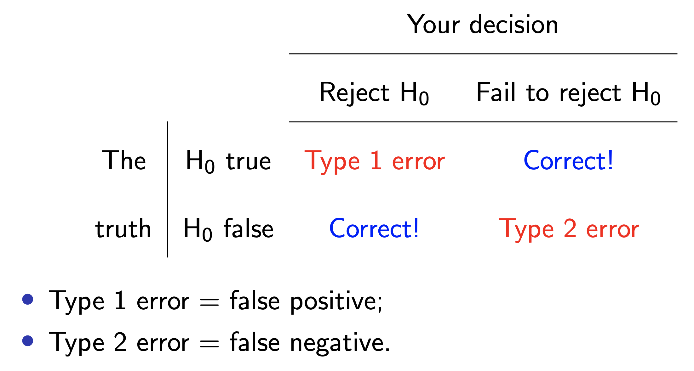
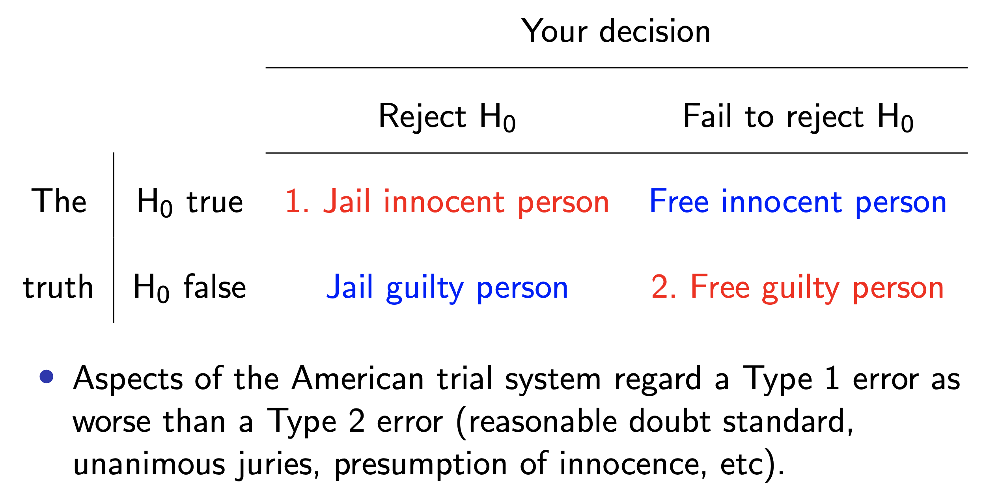
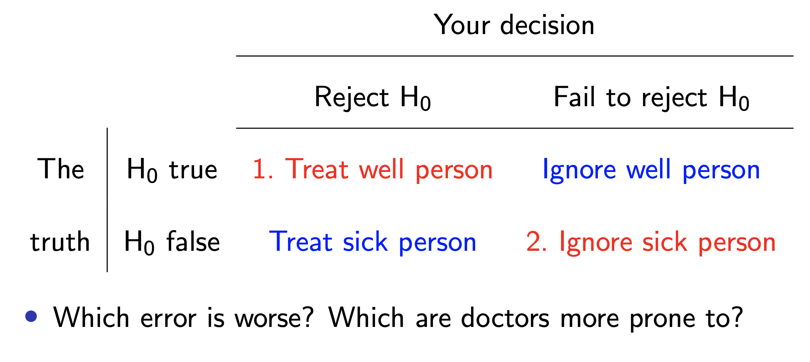
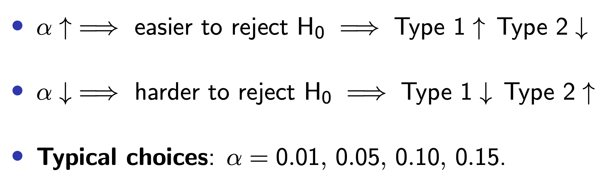

```{r}
#| label: load-packages
#| message: false
#| echo: false
library(tidyverse)
library(tidymodels)
library(openintro)
library(scales)      # for pretty axis labels
library(glue)        # for constructing character strings
library(knitr)       # for neatly formatted tables
volleyball <- read_csv("data/volleyball_cut.csv")
```

## While you wait: Participate 📱💻 {.small}

:::::: columns
:::: {.column width="70%"}
::: wooclap

TBD

::: wooclap-choices
- TBD
- TBD
:::

:::
::::

::: {.column width="30%"}

:::
::::::

## This ain't Zito

Hi, I'm Josh!

::: incremental
- 2nd Year PhD Student in Statistical Science
- Teaching this course in summer
- Fun fact: I'm a professional Saja Boy (Kpop Demon Hunters)
- 
:::


## Zito the GOAT


# Hypothesis testing

## Hypothesis testing

A hypothesis test is a statistical technique used to evaluate *competing claims* using data

::: incremental
-   **Null hypothesis,** $H_0$: An assumption about the population. "There is nothing going on."

-   **Alternative hypothesis,** $H_A$: A research question about the population. "There is something going on".
:::

. . .

Note: Hypotheses are always at the population level!

## Running Example

```{r}
glimpse(volleyball)
```

::: incremental
- Volleyball Dataset on FIVB Athletes
- Spike: How high an athlete touches on a spike (cm)
- Block: How high an athlete touches on a block (cm)
- Height (cm)
:::

## Running Example cont

Question: Is an athlete's spike touch significantly related to their height?

```{r}
observed_fit <- volleyball |>
  specify(spike ~ height) |>
  fit()

observed_fit
```

## Setting hypotheses

-   **Null hypothesis,** $H_0$: "There is nothing going on." The slope of the model for predicting the spike touch of FIVB athletes from their heights is 0, $\beta_1 = 0$.

-   **Alternative hypothesis,** $H_A$: "There is something going on". The slope of the model for predicting the spike touch of FIVB athletes from their heights is different than, $\beta_1 \ne 0$.

## Hypothesis testing "mindset"

-   Assume you live in a world where null hypothesis is true: $\beta_1 = 0$.

-   Ask yourself how likely you are to observe the sample statistic, or something even more extreme, in this world: $P(b_1 \leq -1.62~or~b_1 \geq 1.62 | \beta_1 = 0)$ = ?

## Hypothesis testing as a court trial

-   **Null hypothesis**, $H_0$: Defendant is innocent

-   **Alternative hypothesis**, $H_A$: Defendant is guilty

. . .

-   **Present the evidence:** Collect data

. . .

-   **Judge the evidence:** "Could these data plausibly have happened by chance if the null hypothesis were true?"
    -   Yes: Fail to reject $H_0$
    -   No: Reject $H_0$

## Hypothesis testing as medical diagnosis

-   **Null hypothesis**, $H_0$: patient is fine

-   **Alternative hypothesis**, $H_A$: patient is sick

. . .

-   **Present the evidence:** Collect data

. . .

-   **Judge the evidence:** "Could these data plausibly have happened by chance if the null hypothesis were true?"
    -   Yes: Fail to reject $H_0$
    -   No: Reject $H_0$

## Hypothesis testing framework {.smaller}

::: incremental
-   Start with a null hypothesis, $H_0$, that represents the status quo

-   Set an alternative hypothesis, $H_A$, that represents the research question, i.e. what we’re testing for

-   Conduct a hypothesis test under the assumption that the null hypothesis is true and calculate a **p-value** (probability of observed or more extreme outcome given that the null hypothesis is true)

    -   if the test results suggest that the data do not provide convincing evidence for the alternative hypothesis, stick with the null hypothesis
    -   if they do, then reject the null hypothesis in favor of the alternative
:::

## Calculate observed slope

... which we have already done:

```{r}
observed_fit <- volleyball |>
  specify(spike ~ height) |>
  fit()

observed_fit
```

## Simulate null distribution

```{r, cache=TRUE}
#| code-line-numbers: "|1|2|3|4|5|6"
set.seed(24601)
null_dist <- volleyball |>
  specify(spike ~ height) |>
  hypothesize(null = "independence") |>
  generate(reps = 10000, type = "permute") |>
  fit()
```

## Wait, so what's a null distribution?

::: incremental
-   Simulating a universe under $H_0$: the slope of the model for predicting the spike touch of FIVB athletes from their heights is 0, $\beta_1 = 0$. I.e., no relationship between spike and height.

-  If I "shuffle" the order of the spike variable, is there a relationship between spike and height? Could height predict spike touch?

-  No! Spike is essentially random and unrelated to anything!

-  Shuffle the spike variable, fit a model and get a slope, record the slope, repeat!

- More on this in STA 221L

:::

## Every day I'm shuffling


```{r}
ggplot(volleyball, aes(x = height, y = spike)) +
  geom_point() + 
  geom_smooth(method = "lm")
```
## Every day I'm shuffling

```{r}
ggplot(volleyball, aes(x = height, y = sample(spike))) +
  geom_point() + 
  geom_smooth(method = "lm")
```

```{r}

```


## View null distribution {.smaller}

```{r}
null_dist
```

## Visualize null distribution {.smaller}

```{r}
null_dist |>
  filter(term == "height") |>
  ggplot(aes(x = estimate)) +
  geom_histogram(binwidth = 0.2)
```

## Visualize null distribution (alternative)

```{r}
visualize(null_dist) +
  shade_p_value(obs_stat = observed_fit, direction = "two-sided")
```

## Get p-value

```{r}
null_dist |>
  get_p_value(obs_stat = observed_fit, direction = "two-sided")
```

## Make a decision

::: task
Based on the p-value calculated, what is the conclusion of the hypothesis test?
:::

Since $p = 0.002$, we reject the null hypothesis and have evidence that there is a statistically significant relationship between an FIVB players spike touch and height. 

## Sometimes the test will be wrong



## Think about the judge

$H_0$ person innocent vs $H_A$ person guilty



## Think about the doctor

$H_0$ person well vs $H_A$ person sick.



## How do we negotiate the trade-off?

::: incremental
Pick a threshold $\alpha\in[0,\,1]$ called the **discernibility level** and threshold the $p$-value:

-   If $p\text{-value} < \alpha$, reject null and accept alternative;
-   If $p\text{-value} \geq \alpha$, fail to reject null;
:::

. . .


=======
