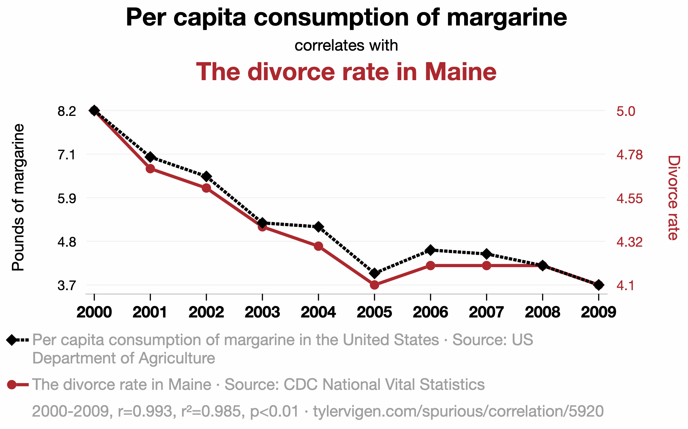
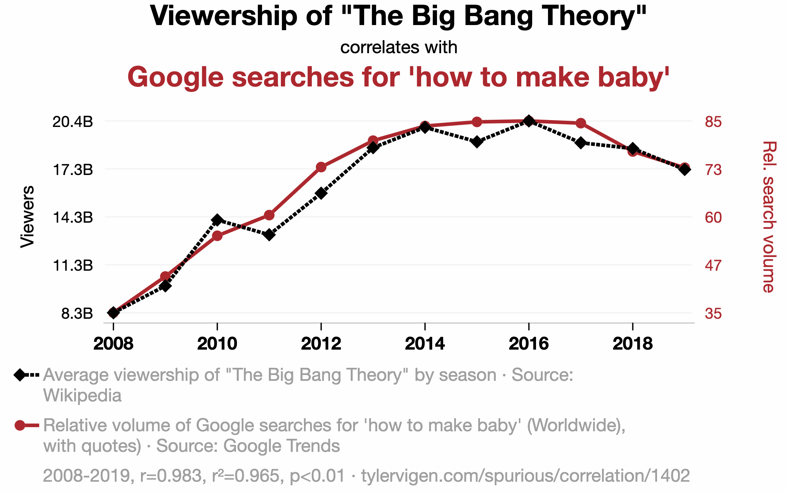
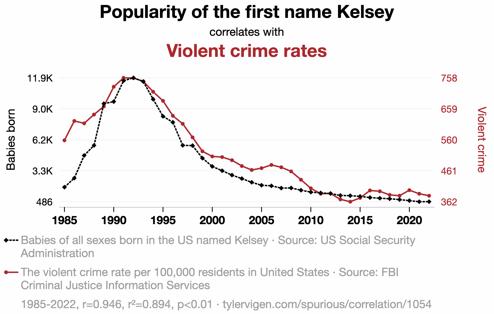
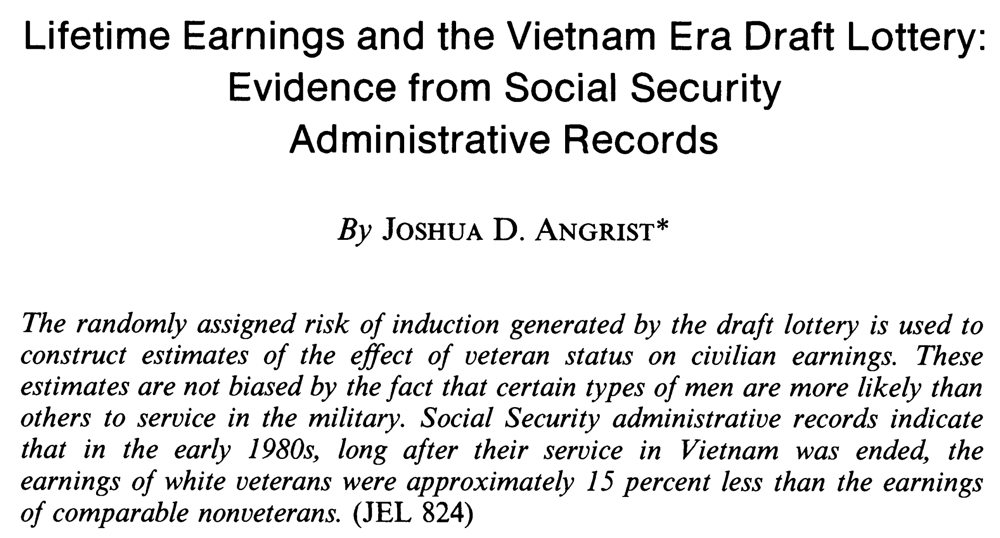

## While you wait: Participate 📱💻 {.xsmall}

```{r}
#| label: load-packages
#| message: false
#| echo: false
library(tidyverse)
library(tidymodels)
library(openintro)
library(palmerpenguins)
todays_ae <- "ae-24-card-krueger"
new_loans <- loans_full_schema |>
  drop_na(annual_income, total_credit_utilized) |>
  filter(log(annual_income) > 0) |>
  filter(log(total_credit_utilized) > 0)
```

:::::: columns
:::: {.column width="70%"}
::: wooclap

```{r}
linear_reg() |>
  fit(body_mass_g ~ flipper_length_mm + sex, penguins) |>
  tidy()
```

What does 347.85 represent in this table?

::: wooclap-choices
- The intercept of the best fit line for female penguins
- The intercept of the best fit line for male penguins
- The slope of the best fit line for female penguins
- The slope of the best fit line for male penguins
- The gap in intercepts of the best fit lines for male and female penguins
- The gap in slopes of the best fit lines for male and female penguins
:::

:::
::::

::: {.column width="30%"}

:::
::::::

# Recap: statistical inference

## Point estimation: what's your best guess? {.scrollable}

```{r}
ggplot(mtcars, aes(x = wt, y = mpg)) + 
  geom_point() +
  geom_smooth(method = "lm")
```

## Point estimation: what's your best guess? {.scrollable}

```{r}
linear_reg() |>
  fit(mpg ~ wt, data = mtcars) |>
  tidy()
```


## Sampling variability 

Different data >> Different estimate. But how different?

- **Reassuring**: recompute your estimate on other data and get basically the same answer. Sampling variation is low. Uncertainty is low. Results are more reliable;

- **Concerning**: recompute your estimate on new data and get a wildly different answer. Sampling variation is high. Uncertainty is high. Results are less reliable.

How do we operationalize this?

## The bootstrap

Construct different, alternative datasets by sampling *with replacement* from your original data. Each bootstrap sample gives you a different estimate, and you can see how vigorously they wiggle around:

```{r}
#| echo: false
#| message: false
#| warning: false
df_boot_samples_100 <- new_loans |>
  mutate(
    log_cred = log(total_credit_utilized),
    log_inc = log(annual_income)
  ) |> 
  slice(sample(1:9000, 100)) |>
  specify(log_cred ~ log_inc) |>
  generate(reps = 200, type = "bootstrap")
```

::: columns
::: {.column width="49%"}
```{r}
#| echo: false
#| message: false
#| warning: false
#| fig-asp: 1
p_df_boot_samples_100 <- ggplot(df_boot_samples_100, aes(x = log_inc, y = log_cred, group = replicate)) +
  geom_line(stat = "smooth", method = "lm", se = FALSE, alpha = 0.05) +
  labs(
    x = "Annual income (log $)",
    y = "Credit utilization (log $)",
  ) +
  #xlim(7, 15) + 
  #ylim(0, 15) + 
  theme(title = element_text(size = 20, face = "bold"))

p_df_boot_samples_100
```
:::

::: {.column width="49%"}
```{r}
#| echo: false
#| message: false
#| warning: false
#| fig-asp: 1
df_boot_samples_100_fit <- df_boot_samples_100 |>
  fit()

df_boot_samples_100_hist <- ggplot(df_boot_samples_100_fit |> filter(term == "log_inc"), aes(x = estimate)) +
  geom_histogram(color = "white") +
  #geom_vline(xintercept = slope, color = "#8F2D56", linewidth = 1) +
  labs(x = "Slope estimate", y = "Count",
       title = "Histogram of alternative estimates") + 
  theme(title = element_text(size = 20, face = "bold"))

df_boot_samples_100_hist
```
:::
:::

## Interval estimation 

Use the bootstrap distribution to construct a range of likely values for the unknown parameter:


```{r}
#| echo: false

df_fit <- linear_reg() |>
  fit(price ~ area, data = duke_forest)

intercept <- tidy(df_fit) |> filter(term == "(Intercept)") |> pull(estimate) |> round()
slope <- tidy(df_fit) |> filter(term == "area") |> pull(estimate) |> round()

set.seed(119)

df_boot_samples_100 <- duke_forest |>
  specify(price ~ area) |>
  generate(reps = 100, type = "bootstrap")

df_boot_samples_100_fit <- df_boot_samples_100 |>
  fit()

df_boot_samples_100_hist <- ggplot(df_boot_samples_100_fit |> filter(term == "area"), aes(x = estimate)) +
  geom_histogram(binwidth = 10, color = "white") +
  geom_vline(xintercept = slope, color = "#8F2D56", linewidth = 1) +
  labs(x = "Slope", y = "Count",
       title = "Slopes of 100 bootstrap samples") +
  scale_x_continuous(labels = label_dollar())

lower <- df_boot_samples_100_fit |>
  ungroup() |>
  filter(term == "area") |>
  summarise(quantile(estimate, 0.025)) |>
  pull()

upper <- df_boot_samples_100_fit |>
  ungroup() |>
  filter(term == "area") |>
  summarise(quantile(estimate, 0.975)) |>
  pull()

df_boot_samples_100_hist +
  geom_vline(xintercept = lower, color = "steelblue", linewidth = 1, linetype = "dashed") +
  geom_vline(xintercept = upper, color = "steelblue", linewidth = 1, linetype = "dashed")
```

We use quantiles (think IQR), but there are other ways.

## Hypothesis testing {.scrollable}

::: incremental
-   Two competing claims about $\beta_1$: $$
    \begin{aligned}
    H_0&: \beta_1=0\quad(\text{nothing going on})\\
    H_A&: \beta_1\neq0\quad(\text{something going on})
    \end{aligned}
    $$

-   Do the data strongly favor one or the other?

-   How can we quantify this?
:::

## Hypothesis testing {.scrollable}

::: incremental
-   Think hypothetically: if the null hypothesis were in fact true, would my results be out of the ordinary?

    -   if no, then the null could be true;
    -   if yes, then the null might be bogus;

-   My results represent the reality of actual data. If they conflict with the null, then you throw out the null and stick with reality;

-   How do we *quantify* "would my results be out of the ordinary"?
:::

## Null distribution {.medium .scrollable}

If the null happened to be true, how would we expect our results to vary across datasets? We can use simulation to answer this:

```{r}
#| echo: false
#| message: false
#| warning: false

set.seed(34)
fake_draws <- tibble(
  replicate = 1:500,
  x = rnorm(500),
  stat = x,
  estimate = x,
) 

fake_draws |>
  ggplot(aes(x = x)) + 
  geom_histogram() + 
  labs(
    title = "Null distribution: variation in the slope estimate if the null were true",
    x = "hypothetical slope estimates",
    y = "count"
  ) + 
  xlim(-5, 5)
```

This is how the world should look *if the null is true*.

## Null distribution versus reality {.medium .scrollable}

Locate the *actual* results of your *actual* data analysis under the null distribution. Are they in the middle? Are they in the tails?

```{r}
#| echo: false
#| message: false
#| warning: false
#| fig-asp: 0.4

fake_draws |>
  ggplot(aes(x = x)) + 
  geom_histogram() + 
  geom_vline(xintercept = 0.5, color = "red", size = 2) + 
  annotate("text", x = 2, y = 65, label = "Your actual\nslope estimate", color = "red", size = 3*.pt) + 
  labs(
    title = "Null distribution: variation in the slope estimate if the null were true",
    x = "hypothetical slope estimates",
    y = "count"
  ) + 
  xlim(-5, 5)
```

Are these results in harmony or conflict with the null?

## Null distribution versus reality {.medium .scrollable}

Locate the *actual* results of your *actual* data analysis under the null distribution. Are they in the middle? Are they in the tails?

```{r}
#| echo: false
#| message: false
#| warning: false
#| fig-asp: 0.4

fake_draws |>
  ggplot(aes(x = x)) + 
  geom_histogram() + 
  geom_vline(xintercept = 5, color = "red", size = 2) + 
  annotate("text", x = 3.5, y = 65, label = "Your actual\nslope estimate", color = "red", size = 3*.pt) + 
  labs(
    title = "Null distribution: variation in the slope estimate if the null were true",
    x = "hypothetical slope estimates",
    y = "count"
  ) + 
  xlim(-5, 5)
```

Are these results in harmony or conflict with the null?

## Null distribution versus reality {.medium .scrollable}

Locate the *actual* results of your *actual* data analysis under the null distribution. Are they in the middle? Are they in the tails?

```{r}
#| echo: false
#| message: false
#| warning: false
#| fig-asp: 0.4

fake_draws |>
  ggplot(aes(x = x)) + 
  geom_histogram() + 
  geom_vline(xintercept = 1.75, color = "red", size = 2) + 
  annotate("text", x = 3.5, y = 65, label = "Your actual\nslope estimate", color = "red", size = 3*.pt) + 
  labs(
    title = "Null distribution: variation in the slope estimate if the null were true",
    x = "hypothetical slope estimates",
    y = "count"
  ) + 
  xlim(-5, 5)
```

Are these results in harmony or conflict with the null?

## *p*-value {.scrollable}

::: incremental
The $p$-value is the probability of being *even farther out* in the tails of the null distribution than your results already were.

-   if this number is very low, then your results would be out of the ordinary if the null were true, so maybe the null was never true to begin with;

-   if this number is high, then your results may be perfectly compatible with the null.
:::

## *p*-value {.scrollable}

*p*-value is the fraction of the histogram area shaded red:

```{r}
#| echo: false
#| message: false
#| warning: false
set.seed(3)
x <- rnorm(100, mean = 0.1, sd = 2)
df <- tibble(x = x)
obs_stat <- df |>
  specify(response = x) |>
  calculate(stat = "mean")
null_dist <- df |>
  specify(response = x) |>
  hypothesize(null = "point", mu = 0) |>
  generate(reps = 1000, type = "bootstrap") |>
  calculate(stat = "mean")


visualize(null_dist) + 
  shade_p_value(obs_stat = obs_stat, direction = "two-sided")
```

. . .

Big ol' *p*-value. Null looks plausible

## *p*-value {.scrollable}

*p*-value is the fraction of the histogram area shaded red:

```{r}
#| echo: false
#| message: false
#| warning: false
set.seed(3)
x <- rnorm(100, mean = 1, sd = 2)
df <- tibble(x = x)
obs_stat <- df |>
  specify(response = x) |>
  calculate(stat = "mean")
null_dist <- df |>
  specify(response = x) |>
  hypothesize(null = "point", mu = 0) |>
  generate(reps = 1000, type = "bootstrap") |>
  calculate(stat = "mean")


visualize(null_dist) + 
  shade_p_value(obs_stat = obs_stat, direction = "two-sided")
```

. . .

*p*-value is basically zero. Null looks bogus.

## *p*-value {.scrollable}

*p*-value is the fraction of the histogram area shaded red:

```{r}
#| echo: false
#| message: false
#| warning: false
set.seed(3)
x <- rnorm(100, mean = 0.5, sd = 4)
df <- tibble(x = x)
obs_stat <- df |>
  specify(response = x) |>
  calculate(stat = "mean")
null_dist <- df |>
  specify(response = x) |>
  hypothesize(null = "point", mu = 0) |>
  generate(reps = 1000, type = "bootstrap") |>
  calculate(stat = "mean")


visualize(null_dist) + 
  shade_p_value(obs_stat = obs_stat, direction = "two-sided")
```

. . .

*p*-value is...kinda small? Null looks...?

## Discernibility level {.scrollable}

::: incremental
-   How do we decide if the *p*-value is big enough or small enough?

-   Pick a threshold $\alpha\in[0,\,1]$ called the *discernibility level*:

    -   If $p\text{-value} < \alpha$, reject null and accept alternative;
    -   If $p\text{-value} \geq \alpha$, fail to reject null;

-   Standard choices: $\alpha=0.01, 0.05, 0.1, 0.15$.
:::


# Redux: association does not imply causation...until it does?

## Plenty of nonsense correlations out there

{fig-align="center"}

## Plenty of nonsense correlations out there

{fig-align="center"}

## Plenty of nonsense correlations out there

{fig-align="center"}

## So, when can we draw causal conclusions?

::: incremental
- Best hope: run a controlled, randomized experiment:

    - get a big, representative, random sample from target population;
    - randomly divide subjects into treatment and control;
    - difference in outcomes was *caused* by the treatment alone;
    - but this may be too costly or unethical.
    
- Observational data are very challenging:

    - you couldn't control a gosh darned thing;
    - different outcomes could be caused by confounding factors, which you may or may not have measured.
:::

## A proper, controlled experiment 

Does treatment using embryonic stem cells (ESCs) help improve heart function following a heart attack? Each sheep in the study was randomly assigned to the ESC or control group, and the change in their hearts' pumping capacity was measured in the study. A positive value corresponds to increased pumping capacity, which generally suggests a stronger recovery.

. . .

```{r}
#| attr-output: "style='font-size: 0.5em'"
glimpse(stem_cell)
```

## ABV {.scrollable}

```{r}
stem_cell <- stem_cell |>
  mutate(change = after - before)

ggplot(stem_cell, aes(x = change, y = trmt)) + 
  geom_boxplot()
```

## Model fit

```{r}
linear_reg() |>
  fit(change ~ trmt, data = stem_cell) |>
  tidy()
```

$$
\widehat{change}=-4.33+7.83\times \texttt{esc}
$$


## Remember... {.scrollable}

$$
\widehat{change}=-4.33+7.83\times \texttt{esc}
$$

::: incremental
- `trmt` is categorical with two levels: `ctrl` (0) and `esc` (1). 
- The control group has `esc = 0`, so 
$$
\widehat{change} = -4.33;
$$

- The treatment group has `esc = 1`, so 
$$
\widehat{change} = -4.33+7.83=3.5.
$$
:::

## Those were not magic numbers 

```{r}
stem_cell |>
  group_by(trmt) |>
  summarize(
    mean_change = mean(change)
  )
```

. . .

::: callout-note
## Don't forget!

In a simple linear regression with a numerical response and a binary predictor, the slope estimate is the difference in the average response between the two groups.

:::

## Confidence interval

```{r}
#| message: false
#| warning: false
#| echo: false

set.seed(1234)

boot_fits <- stem_cell |>
  specify(change ~ trmt) |>
  generate(reps = 1000, type = "bootstrap") |>
  fit()

observed_fit <- stem_cell |>
  specify(change ~ trmt) |>
  fit()

ci_95 <- get_confidence_interval(
  boot_fits,
  point_estimate = observed_fit,
  level = 0.95,
  type = "percentile"
)

boot_fits |>
  filter(term == "trmtesc") |>
  ggplot(aes(x = estimate)) +
  geom_histogram() +
  geom_vline(xintercept = observed_fit |> filter(term == "trmtesc") |> pull(estimate),
             color = "#8F2D56", linewidth = 1) + 
  geom_vline(xintercept = ci_95 |> filter(term == "trmtesc") |> pull(lower_ci), 
             color = "steelblue", size = 1, linetype = "dashed") + 
  geom_vline(xintercept = ci_95 |> filter(term == "trmtesc") |> pull(upper_ci),
             color = "steelblue", size = 1, linetype = "dashed") + 
  labs(
    title = "Boostrap distribution",
    x = "Estimated difference (Treament - Control)"
  )
```

We are 95% confident that the true mean difference is between 4.34 and 11.7.

## Competing claims

Are the data sufficiently informative to tell the difference between these two possibilities?

$$
\begin{aligned}
H_0&: \beta_1=0 && (\text{no effect})\\
H_0&: \beta_1\neq0 && (\text{some effect})\\
\end{aligned}
$$

- $\beta_1$ is the difference in mean response between the treatment and control group;
- the alternative does not specify if the effect is positive or negative;
- the alternative does not specify that the effect is "large".

## Hypothesis test

```{r}
#| message: false
#| warning: false
#| echo: false

set.seed(1234)
null_dist <- stem_cell |>
  specify(change ~ trmt) |>
  hypothesize(null = "independence") |>
  generate(reps = 1000, type = "permute") |>
  fit()


visualize(null_dist) +
  shade_p_value(obs_stat = observed_fit, direction = "two-sided")
```

. . . 

The p-value is basically zero.

## Cardinal Sins in Statistics No. 426

::: incremental 
- In a hypothetical world where the treatment has no effect, it would be very unlikely to get results like the ones we did;

- Evidence is sufficient to *reject the null*. There is *some* effect;

- If you are convinced by the experimental design, the effect is *causal*;

- Is the effect large and meaningful and something you should base major decisions on? Statistics cannot answer that question!
:::

. . .

> Statistical discernibility $\neq$ Substantive importance

## A purely observational study 

A random sample of US births from 2014:

```{r}
#| attr-output: "style='font-size: 0.6em'"
glimpse(births14)
```

Does a mother's smoking `habit` *cause* low birth `weight`? Perhaps, but concluding that from these data might be challenging.

## Visualize {.scrollable}

```{r}
births14 |>
  drop_na(weight, habit) |>
  ggplot(aes(x = weight, y = habit)) + 
  geom_boxplot(alpha = 0.5) + 
  labs(
    x = "Birth Weight (lbs)",
    y = "Mother smoking status"
  )
```

## Estimate

```{r}
linear_reg() |>
  fit(weight ~ habit, data = births14) |>
  tidy()
```

$$
\widehat{weight}=7.27-0.59\times \texttt{smoker}.
$$

## Confidence interval 

```{r}
#| message: false
#| warning: false
#| echo: false

set.seed(1234)

boot_fits <- births14 |>
  specify(weight ~ habit) |>
  generate(reps = 1000, type = "bootstrap") |>
  fit()

observed_fit <- births14 |>
  specify(weight ~ habit) |>
  fit()

ci_95 <- get_confidence_interval(
  boot_fits,
  point_estimate = observed_fit,
  level = 0.95,
  type = "percentile"
)

boot_fits |>
  filter(term == "habitsmoker") |>
  ggplot(aes(x = estimate)) +
  geom_histogram() +
  geom_vline(xintercept = observed_fit |> filter(term == "habitsmoker") |> pull(estimate),
             color = "#8F2D56", linewidth = 1) + 
  geom_vline(xintercept = ci_95 |> filter(term == "habitsmoker") |> pull(lower_ci), 
             color = "steelblue", size = 1, linetype = "dashed") + 
  geom_vline(xintercept = ci_95 |> filter(term == "habitsmoker") |> pull(upper_ci),
             color = "steelblue", size = 1, linetype = "dashed") + 
  labs(
    title = "Boostrap distribution",
    x = "Estimated difference (Smoker - Non-smoker)"
  )
```

## Hypothesis test

```{r}
#| message: false
#| warning: false
#| echo: false

set.seed(1234)
null_dist <- births14 |>
  specify(weight ~ habit) |>
  hypothesize(null = "independence") |>
  generate(reps = 1000, type = "permute") |>
  fit()


visualize(null_dist) +
  shade_p_value(obs_stat = observed_fit, direction = "two-sided")
```

. . . 

The p-value is basically zero.


## Cardinal Sins in Statistics No. 2135

::: incremental
- Evidence is sufficient to reject the null: smoking during pregnancy is *associated* with a difference in birth weight;

- Is smoking *causing* birth weight to change?

- The data are observational, and there are many unmeasured factors that could bear on both `habit` and `weight`.

- Maybe there is a causal relationship, and maybe it can be teased out with data like these, but we have all of our work ahead of us.
:::

. . .

> Just because there is a statistically discernible association does not mean there is a causal relationship.

## Natural experiments

The four-leaf clover of applied statistics:

- You stumble upon observational data where "nature" has accidentally randomized treatment/control for you, *as if* a controlled experiment was performed;

- If you're extra lucky and careful and shrewd, *maybe* you can use these special data to tell a causal story.


## Natural experiments



## Nobel prize winning research

{fig-align="center"}

## Another natural experiment: Card and Krueger {.scrollable}

{fig-align="center"}

## The ECON 101 story

{fig-align="center"}
This is a claim (hypothesis!) about how the data will look. Let's see!

## `{r} todays_ae` {.smaller}

::: appex
-   Go to your ae project in RStudio.

-   If you haven't yet done so, make sure all of your changes up to this point are committed and pushed, i.e., there's nothing left in your Git pane.

-   If you haven't yet done so, click Pull to get today's application exercise file: *`{r} paste0(todays_ae, ".qmd")`*.

-   Work through the application exercise in class, and render, commit, and push your edits.
:::
